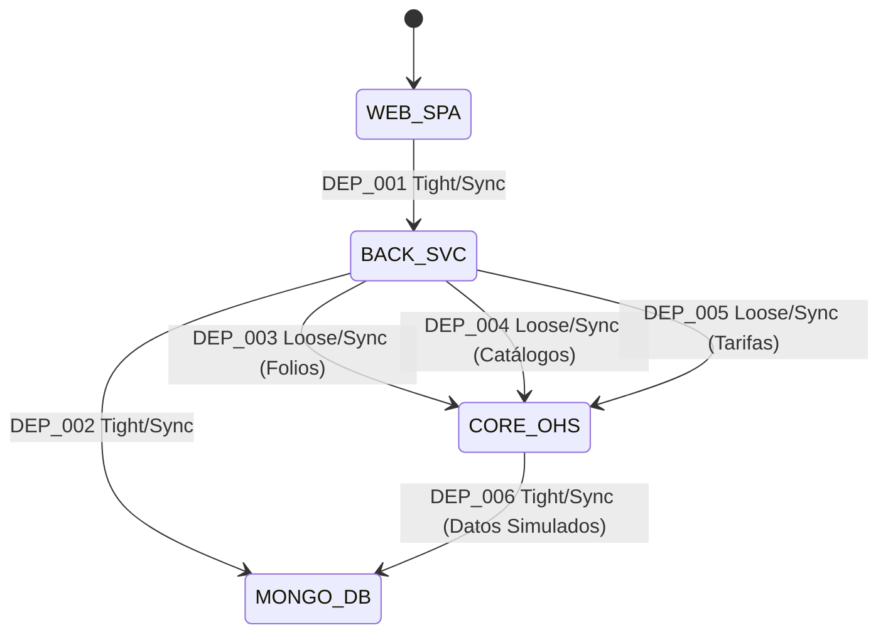
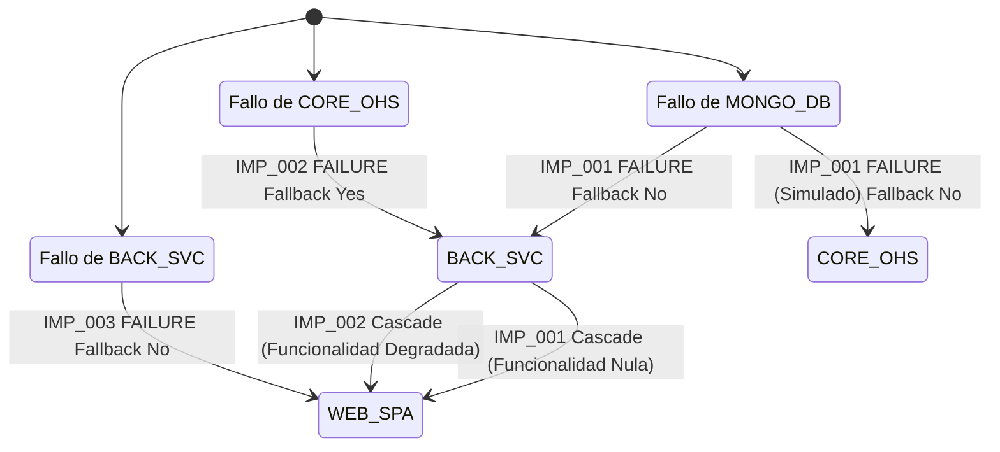
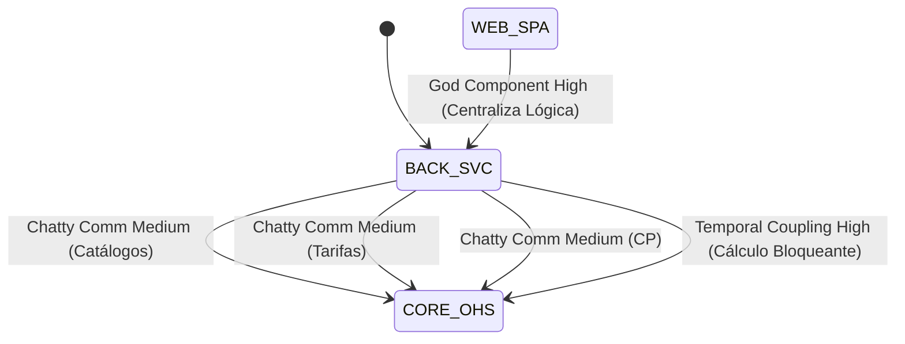
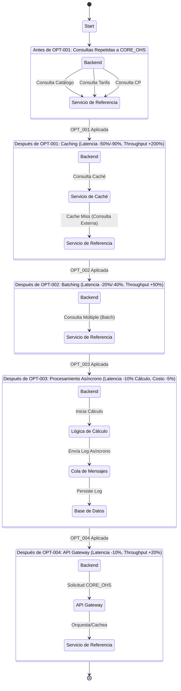

# Dependencias

## Clasificación de Dependencias

Las dependencias entre componentes se clasifican por su naturaleza técnica, patrón de comunicación y criticidad, basándose en el contexto y los requerimientos funcionales y no funcionales.

| id | origen | nombre_origen | destino | nombre_destino | acoplamiento | patron | criticidad | direccion | frecuencia |
|---|---|---|---|---|---|---|---|---|---|
| DEP-001 | WEB_SPA | cotizador-danos-web (Frontend SPA) | BACK_SVC | plataformas-danos-back (Backend Principal) | Tight | Synchronous | Critical | Unidirectional | Very High |
| DEP-002 | BACK_SVC | plataformas-danos-back (Backend Principal) | MONGO_DB | Base de Datos MongoDB | Tight | Synchronous | Critical | Unidirectional | Very High |
| DEP-003 | BACK_SVC | plataformas-danos-back (Backend Principal) | CORE_OHS | Plataforma-core-ohs (Generación de Folios) | Loose | Synchronous | Critical | Unidirectional | High |
| DEP-004 | BACK_SVC | plataformas-danos-back (Backend Principal) | CORE_OHS | Plataforma-core-ohs (Catálogos de Referencia) | Loose | Synchronous | High | Unidirectional | Medium |
| DEP-005 | BACK_SVC | plataformas-danos-back (Backend Principal) | CORE_OHS | Plataforma-core-ohs (Tarifas y Factores Técnicos) | Loose | Synchronous | Critical | Unidirectional | High |
| DEP-006 | CORE_OHS | Plataforma-core-ohs (Simulado) | MONGO_DB | Base de Datos MongoDB | Tight | Synchronous | High | Unidirectional | High |

## Análisis de Impacto en Cascada

Se analiza el efecto dominó de fallos en componentes críticos, identificando componentes directa e indirectamente afectados, mecanismos de recuperación y tiempos estimados.

| id | componente | nombre_componente | escenario_fallo | afectados_directos | afectados_cascada | impacto | fallback | mecanismo | tiempo_recuperacion |
|---|---|---|---|---|---|---|---|---|---|
| IMP-001 | MONGO_DB | Base de Datos MongoDB | Caída de la base de datos o corrupción de datos | BACK_SVC, CORE_OHS (simulado) | WEB_SPA | Severe | No | Replicación de DB, backups, restauración | 30min - 4h |
| IMP-002 | CORE_OHS | Plataforma-core-ohs (Servicio de Referencia) | Servicio externo no disponible o con alta latencia | BACK_SVC | WEB_SPA | Severe | Sí | Circuit Breaker, Retries, Caché, Fallback degradado | 5s - 10min |
| IMP-003 | BACK_SVC | plataformas-danos-back (Backend Principal) | Caída del servicio backend o errores internos | WEB_SPA |  | Severe | No | Balanceo de carga, auto-escalado, reinicio automático | 2min - 15min |

## Detección de Anti-Patterns

Identificación de patrones de diseño problemáticos que comprometen la calidad arquitectónica, evaluando su severidad, síntomas, consecuencias y estrategias de refactorización.

| anti_pattern | componentes | nombres_componentes | severidad | sintomas | consecuencias | refactorizacion | esfuerzo | prioridad |
|---|---|---|---|---|---|---|---|---|
| God Component | BACK_SVC | plataformas-danos-back (Backend Principal) | High | Centraliza toda la lógica de negocio, persistencia e integración con servicios externos. | Baja mantenibilidad, cuello de botella de rendimiento, difícil de escalar independientemente, alto impacto en cambios. | Modularización del backend (ej. microservicios por dominio), división de responsabilidades. | High | High |
| Chatty Communication | BACK_SVC, CORE_OHS | Backend Principal, Plataforma-core-ohs (Servicio de Referencia) | Medium | Múltiples llamadas síncronas individuales a CORE_OHS para cada interacción de usuario (catálogos, tarifas, CP). | Alta latencia (RNF-003), sobrecarga de red, baja resiliencia si CORE_OHS es lento/falla. | Batching de solicitudes, caching extensivo de datos maestros, uso de API Gateway para consolidación. | Medium | High |
| Temporal Coupling | BACK_SVC, CORE_OHS | Backend Principal, Plataforma-core-ohs (Servicio de Referencia) | High | El cálculo de primas y validaciones se bloquean esperando respuestas síncronas de CORE_OHS. | Baja disponibilidad del cálculo, alta latencia para el usuario, impacto en la experiencia de usuario. | Estrategia de caché con TTL/actualización programada, uso de fallbacks, considerar un modelo event-driven. | Medium | High |

## Oportunidades de Optimización

Propuestas de mejoras específicas en la comunicación de componentes para reducir latencia, costos y aumentar el rendimiento, cuantificando los beneficios esperados y evaluando la complejidad de implementación.

| id | tipo | deps_afectadas | nombres_componentes | problema | solucion | latencia | throughput | ahorro | complejidad | valor | prioridad |
|---|---|---|---|---|---|---|---|---|---|---|---|
| OPT-001 | Caching | DEP_004, DEP_005 | Backend Principal, Plataforma-core-ohs (Servicio de Referencia) | Alta latencia y carga por consultas repetidas a CORE_OHS para catálogos y tarifas. | Implementar caché con TTL configurable y actualización programada para catálogos y tarifas. | -50% a -90% | +200% | -10% CPU (backend), menos llamadas externas | Medium | High | High |
| OPT-002 | Batching | DEP_004, DEP_005 | Backend Principal, Plataforma-core-ohs (Servicio de Referencia) | Múltiples llamadas síncronas individuales a CORE_OHS para obtener varios elementos de catálogos o tarifas. | Consolidar múltiples solicitudes de datos a CORE_OHS en una sola llamada (si la API lo permite). | -20% a -40% | +50% | -5% Network/CPU | Medium | Medium | Medium |
| OPT-003 | Async | DEP_002 | Backend Principal, Base de Datos MongoDB | Operaciones de logging/auditoría bloquean el hilo principal de cálculo de primas. | Mover el registro de trazabilidad de cálculo a un proceso asíncrono (ej. cola de mensajes). | -10% (hilo principal de cálculo) | +10% | -5% CPU (hilo principal) | Medium | Medium | Medium |
| OPT-004 | Gateway | DEP_003, DEP_004, DEP_005 | Backend Principal, Plataforma-core-ohs (Servicio de Referencia) | El Backend maneja directamente la complejidad de múltiples endpoints y la resiliencia de CORE_OHS. | Introducir un API Gateway para CORE_OHS que centralice la orquestación, caching y resiliencia. | -10% | +20% | -5% CPU (backend), gestión más sencilla | High | High | Medium |

## Impacto en Atributos de Calidad

Se analiza cómo las dependencias entre componentes afectan los atributos de calidad del sistema, identificando problemas y proponiendo recomendaciones de mejora.

| atributo | estado | deps_problematicas | nombres_componentes | issue | severidad | mejoras | prioridad |
|---|---|---|---|---|---|---|---|
| Performance | Poor | DEP_001, DEP_003, DEP_004, DEP_005 | Frontend, Backend, Servicio de Referencia | Alta latencia en UI y operaciones CRUD/Cálculo debido a dependencias síncronas y externas (CORE_OHS). | Critical | Implementar caching para CORE_OHS, batching de solicitudes, optimizar consultas a MongoDB, mejorar resiliencia del CORE_OHS. | Critical |
| Scalability | Fair | DEP_001, DEP_003, DEP_004, DEP_005 | Frontend, Backend, Servicio de Referencia | El Backend (BACK_SVC) es un 'God Component' con demasiadas responsabilidades, y CORE_OHS puede ser un cuello de botella. | High | Modularizar el Backend (microservicios), introducir un API Gateway, caching, monitoreo de la carga de CORE_OHS. | High |
| Availability | Fair | DEP_002, DEP_003, DEP_004, DEP_005 | Backend, DB MongoDB, Servicio de Referencia | Fallos en MongoDB o CORE_OHS pueden causar una indisponibilidad severa del sistema completo (puntos únicos de fallo). | Critical | Implementar replicación de MongoDB, Circuit Breaker, Retries y Fallbacks para CORE_OHS, caching para datos vitales. | Critical |
| Security | Good | DEP_001, DEP_002, DEP_003, DEP_004, DEP_005 | Frontend, Backend, DB MongoDB, Servicio de Referencia | Riesgos inherentes en la comunicación con servicios externos y persistencia de datos sensibles si no se aplican RNF de seguridad. | High | Asegurar TLS 1.2+ en todas las comunicaciones, cifrado AES-256 en reposo para datos sensibles, autenticación y autorización robustas. | High |
| Maintainability | Fair | BACK_SVC | plataformas-danos-back (Backend Principal) | La alta complejidad del Backend ('God Component') y la integración con CORE_OHS dificultan su mantenimiento y evolución. | Medium | Modularización del Backend, estandarización de contratos con CORE_OHS, implementación robusta de logging y trazabilidad de errores. | High |

```mermaid
stateDiagram-v2
    state fork_attrs <<fork>>
    [*] --> fork_attrs
    fork_attrs --> Performance_Attr
    fork_attrs --> Scalability_Attr
    fork_attrs --> Availability_Attr
    fork_attrs --> Security_Attr
    fork_attrs --> Maintainability_Attr

    Performance_Attr --> DEP_001 : Critical Severity Critical Priority (WEB-BACK Latency)
    Performance_Attr --> DEP_003 : Critical Severity Critical Priority (CORE_OHS Latency)
    Performance_Attr --> DEP_004 : Critical Severity Critical Priority (CORE_OHS Latency)
    Performance_Attr --> DEP_005 : Critical Severity Critical Priority (CORE_OHS Latency)

    Scalability_Attr --> DEP_001 : High Severity High Priority (Backend Bottleneck)
    Scalability_Attr --> DEP_003 : High Severity High Priority (CORE_OHS Bottleneck)
    Scalability_Attr --> DEP_004 : High Severity High Priority (CORE_OHS Bottleneck)
    Scalability_Attr --> DEP_005 : High Severity High Priority (CORE_OHS Bottleneck)

    Availability_Attr --> DEP_002 : Critical Severity Critical Priority (DB Single Point)
    Availability_Attr --> DEP_003 : Critical Severity Critical Priority (CORE_OHS Single Point)
    Availability_Attr --> DEP_004 : Critical Severity Critical Priority (CORE_OHS Single Point)
    Availability_Attr --> DEP_005 : Critical Severity Critical Priority (CORE_OHS Single Point)

    Security_Attr --> DEP_001 : High Severity High Priority (Data in Transit)
    Security_Attr --> DEP_002 : High Severity High Priority (Data at Rest)
    Security_Attr --> DEP_003 : High Severity High Priority (External Comms)
    Security_Attr --> DEP_004 : High Severity High Priority (External Comms)
    Security_Attr --> DEP_005 : High Severity High Priority (External Comms)

    state "plataformas-danos-back (Backend Principal)" as BACK_SVC_STATE
    Maintainability_Attr --> BACK_SVC_STATE : Medium Severity High Priority (God Component Complexity)

    state join_attrs <<join>>
    DEP_001 --> join_attrs
    DEP_002 --> join_attrs
    DEP_003 --> join_attrs
    DEP_004 --> join_attrs
    DEP_005 --> join_attrs
    BACK_SVC_STATE --> join_attrs
    join_attrs --> [*]
```

