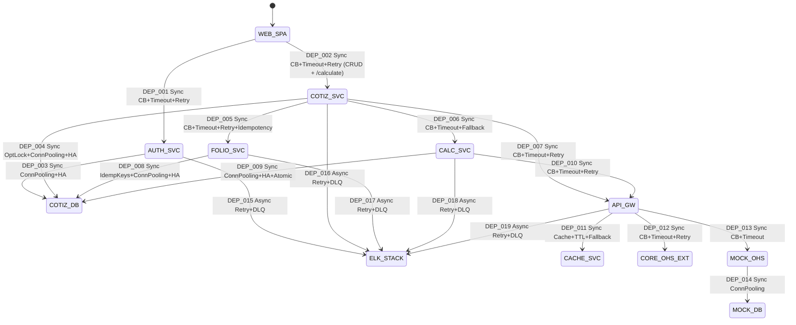
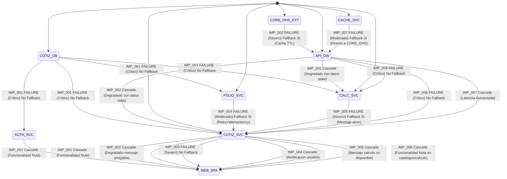
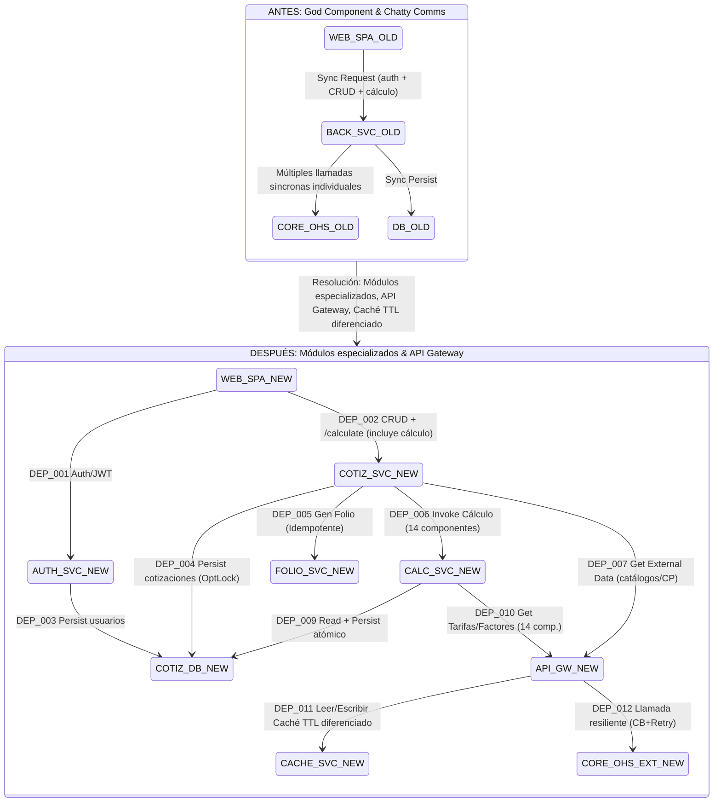
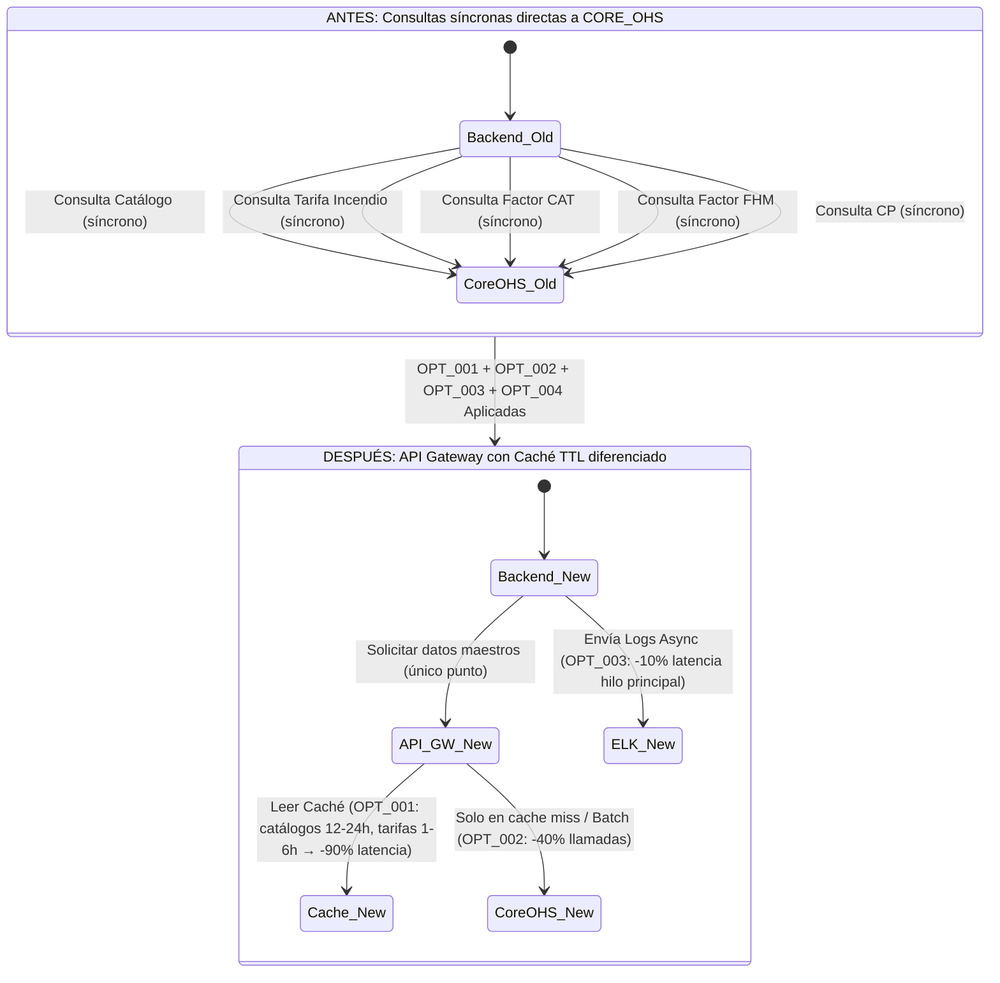
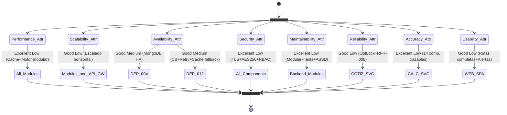

## 1. Clasificación Evolutiva de Dependencias

**Tabla de clasificación evolutiva de dependencias**: Dependencias del sistema extendidas con patrones de resiliencia específicos, SLAs requeridos y estrategias de mitigación configuradas.

> **Decisión de diseño**: El `Cotizador Web SPA` nunca llama directamente al `Motor de Cálculo de Primas`. El endpoint `POST /api/v1/quotes/{folio}/calculate` está expuesto por el `Cotización Service`, que internamente delega al motor de cálculo. Esto evita que la UI tenga que conocer la topología interna del backend.

| id | origen | nombre_origen | destino | nombre_destino | coupling | pattern | criticality | protocol_tech | required_sla | proposed_resilience |
|---|---|---|---|---|---|---|---|---|---|---|
| DEP-001 | WEB_SPA | Cotizador Web SPA — Interfaz de usuario | AUTH_SVC | Módulo de Autenticación — Gestiona usuarios y JWT | Loose | Sync | High | HTTPS JSON | P95 < 200ms | CB 5 fails/10s Timeout 3s Retry 3x exp backoff |
| DEP-002 | WEB_SPA | Cotizador Web SPA — Interfaz de usuario | COTIZ_SVC | Cotización Service — CRUD cotizaciones, layouts, coberturas, estados e invocación de cálculo | Loose | Sync | Critical | HTTPS JSON | P95 < 500ms (CRUD) / P98 < 3s (cálculo) | CB 5 fails/10s Timeout 10s Retry 3x exp backoff |
| DEP-003 | AUTH_SVC | Módulo de Autenticación | COTIZ_DB | Base de Datos de Cotizaciones — Persistencia usuarios y roles | Tight | Sync | High | MongoDB Protocol | P95 < 100ms | Connection Pooling HA Replicas |
| DEP-004 | COTIZ_SVC | Cotización Service | COTIZ_DB | Base de Datos de Cotizaciones — Persistencia cotizaciones y ubicaciones | Tight | Sync | Critical | MongoDB Protocol | P95 < 100ms | Versionado Optimista Connection Pooling HA Replicas |
| DEP-005 | COTIZ_SVC | Cotización Service | FOLIO_SVC | Módulo de Folios — Generación de folios idempotente | Loose | Sync | High | HTTP interno | P95 < 200ms | CB 3 fails/5s Timeout 2s Retry 5x exp backoff Idempotency Keys |
| DEP-006 | COTIZ_SVC | Cotización Service | CALC_SVC | Motor de Cálculo de Primas — Ejecuta cálculo de prima con 14 componentes | Loose | Sync | Critical | HTTP interno | P98 < 3s | CB 5 fails/10s Timeout 10s Fallback Mensaje de error al usuario |
| DEP-007 | COTIZ_SVC | Cotización Service | API_GW | API Gateway de Integración — Consulta catálogos y validación de CP | Loose | Sync | High | HTTPS JSON | P95 < 300ms | CB 5 fails/10s Timeout 5s Retry 3x exp backoff |
| DEP-008 | FOLIO_SVC | Módulo de Folios | COTIZ_DB | Base de Datos de Cotizaciones — Secuencia de folios con control de concurrencia | Tight | Sync | High | MongoDB Protocol | P95 < 100ms | Idempotency Keys Connection Pooling HA Replicas |
| DEP-009 | CALC_SVC | Motor de Cálculo de Primas | COTIZ_DB | Base de Datos de Cotizaciones — Lectura de cotización y persistencia atómica de resultados | Tight | Sync | Critical | MongoDB Protocol | P95 < 100ms | Connection Pooling HA Replicas Operación Atómica |
| DEP-010 | CALC_SVC | Motor de Cálculo de Primas | API_GW | API Gateway de Integración — Consulta tarifas y factores técnicos (14 componentes) | Loose | Sync | Critical | HTTPS JSON | P95 < 300ms | CB 5 fails/10s Timeout 5s Retry 3x exp backoff Fallback caché |
| DEP-011 | API_GW | API Gateway de Integración | CACHE_SVC | Servicio de Caché — Datos maestros con TTL diferenciado | Loose | Sync | High | Caffeine/Redis Protocol | P95 < 50ms | TTL diferenciado: catálogos 12-24h tarifas 1-6h Fallback Datos Stale LRU Desalojo |
| DEP-012 | API_GW | API Gateway de Integración | CORE_OHS_EXT | Plataforma Core OHS (Externo) — Producción | Loose | Sync | Critical | HTTPS JSON | P95 < 500ms | CB 5 fails/10s Timeout 5s Retry 3x exp backoff |
| DEP-013 | API_GW | API Gateway de Integración | MOCK_OHS | Simulador Plataforma Core OHS — Dev/Test (Node.js/Express) | Loose | Sync | Medium | HTTPS JSON | P95 < 100ms | CB 3 fails/5s Timeout 2s |
| DEP-014 | MOCK_OHS | Simulador Plataforma Core OHS | MOCK_DB | Base de Datos del Simulador — MongoDB + Flyway | Tight | Sync | Medium | MongoDB Protocol | P95 < 50ms | Connection Pooling |
| DEP-015 | AUTH_SVC | Módulo de Autenticación | ELK_STACK | Sistema de Observabilidad — Logs y Métricas | Loose | Async | Low | TCP/5044 | Eventual Consistency | Retry 3x DLQ |
| DEP-016 | COTIZ_SVC | Cotización Service | ELK_STACK | Sistema de Observabilidad — Logs y Métricas | Loose | Async | Medium | TCP/5044 | Eventual Consistency | Retry 3x DLQ |
| DEP-017 | FOLIO_SVC | Módulo de Folios | ELK_STACK | Sistema de Observabilidad — Logs y Métricas | Loose | Async | Low | TCP/5044 | Eventual Consistency | Retry 3x DLQ |
| DEP-018 | CALC_SVC | Motor de Cálculo de Primas | ELK_STACK | Sistema de Observabilidad — Logs y Métricas | Loose | Async | Medium | TCP/5044 | Eventual Consistency | Retry 3x DLQ |
| DEP-019 | API_GW | API Gateway de Integración | ELK_STACK | Sistema de Observabilidad — Logs y Métricas | Loose | Async | Medium | TCP/5044 | Eventual Consistency | Retry 3x DLQ |

### Diagrama — Dependencias con Resiliencia

---

## 2. Impacto en Cascada con Resiliencia

**Tabla de impacto en cascada con resiliencia**: Análisis de efecto dominó con mecanismos de mitigación específicos, SLOs objetivo y tiempos de recuperación para cada escenario de fallo.

| id | componente | nombre_componente | escenario_fallo | afect_directos | afect_cascada | impacto | fallback | mecanismo_mitigacion | tiempo_rec | slo_objetivo |
|---|---|---|---|---|---|---|---|---|---|---|
| IMP-001 | COTIZ_DB | Base de Datos de Cotizaciones — Persistencia crítica | Caída total de la base de datos | AUTH_SVC, COTIZ_SVC, FOLIO_SVC, CALC_SVC | WEB_SPA | Crítico | No | Replicación HA, Backups automáticos, Restauración PITR | 30min - 4h | 99.5% uptime |
| IMP-002 | CORE_OHS_EXT | Plataforma Core OHS (Externo) — Datos de referencia | Servicio externo no disponible o alta latencia | API_GW | COTIZ_SVC, CALC_SVC, WEB_SPA | Severo | Sí | CB 5 fails/10s, Retry 3x exp backoff, Caché (catálogos 12-24h, tarifas 1-6h) como fallback con datos stale, mensaje amigable en <5s | 5s - 10min | 99.5% uptime con funcionalidad degradada |
| IMP-003 | COTIZ_SVC | Cotización Service — Lógica de negocio principal | Caída del servicio o errores internos | WEB_SPA | N/A | Severo | No | Balanceo de carga, Auto-escalado, Health checks, Reinicio automático | 2min - 15min | 99.5% uptime P95 < 500ms |
| IMP-004 | FOLIO_SVC | Módulo de Folios — Generación de folios | Fallo en la generación de folio por concurrencia o error interno | COTIZ_SVC | WEB_SPA | Moderado | Sí | Idempotency keys, Retry 5x exp backoff, Notificación al usuario con opción de reintento manual | < 1min | P95 < 200ms |
| IMP-005 | CALC_SVC | Motor de Cálculo de Primas — 14 componentes técnicos | Fallo o timeout en el cálculo de primas | COTIZ_SVC, WEB_SPA | N/A | Severo | Sí | CB 5 fails/10s, Fallback mensaje "Cálculo temporalmente no disponible, intente nuevamente", Retries internos. Nota: el fallo del motor afecta solo al cálculo; los datos de la cotización (ubicaciones, coberturas) permanecen íntegros. | < 1min | P98 < 3s |
| IMP-006 | API_GW | API Gateway de Integración — Resiliencia externa | Caída del API Gateway | COTIZ_SVC, CALC_SVC | WEB_SPA | Crítico | No | Despliegue en HA, Balanceo de carga, Auto-escalado, Health checks | 2min - 5min | 99.5% uptime |
| IMP-007 | CACHE_SVC | Servicio de Caché — Datos maestros | Fallo del servicio de caché (Caffeine o Redis) | API_GW | COTIZ_SVC, CALC_SVC, WEB_SPA | Moderado | Sí | Fallback a CORE_OHS_EXT directo con CB activo, mayor latencia temporal. Con Caffeine (in-process): prácticamente sin impacto. Con Redis: fallback a consulta directa. | 10s - 2min | P95 < 50ms (caché) / P95 < 500ms (fallback directo) |

### Diagrama — Impacto en Cascada

---

## 3. Resolución de Anti-Patterns

**Tabla de resolución de anti-patrones**: Soluciones propuestas para anti-patrones identificados en AS-IS con patrones de resiliencia, esfuerzo estimado y beneficios cuantificables.

| asis_antipattern | components | component_names | specific_problem | proposed_solution | resilience_pattern | effort | priority | expected_benefit |
|---|---|---|---|---|---|---|---|---|
| God Component | BACK_SVC | plataformas-danos-back (Backend Principal) | Centraliza toda la lógica (autenticación, cotizaciones, folios, cálculo), persistencia e integración. Baja mantenibilidad y escalabilidad. | Modularización en módulos especializados: Auth, CotizSvc, FolioSvc, CalcEngineSvc. Introducción de API Gateway para centralizar la integración con `Plataforma-core-ohs`. El SPA solo interactúa con Auth y CotizSvc. | Bulkhead + Service Discovery | High | High | Mantenibilidad +50%, Escalabilidad +200%, Separación de responsabilidades, Cobertura de pruebas por módulo |
| Chatty Communication | BACK_SVC, CORE_OHS_EXT | Backend Principal, Plataforma Core OHS | Múltiples llamadas síncronas individuales a CORE_OHS para catálogos, tarifas y validaciones CP en cada operación. | API Gateway con caché de TTL diferenciado (catálogos: 12-24h; tarifas: 1-6h) y batching de solicitudes a CORE_OHS cuando sea posible. | Cache + Batching + Circuit Breaker | Medium | High | Latencia -50%/-90% P95 < 300ms, Llamadas externas -80%, Throughput +200% |
| Temporal Coupling | BACK_SVC, CORE_OHS_EXT | Backend Principal, Plataforma Core OHS | El cálculo de primas se bloquea esperando respuestas síncronas de CORE_OHS para tarifas y catálogos en cada ejecución. | API Gateway con caché para datos críticos, Circuit Breaker con fallback de datos stale cuando el servicio externo falla. El motor de cálculo consume datos de la caché, no del servicio externo directamente. | Cache + Circuit Breaker + Fallback | Medium | High | Disponibilidad del cálculo +99.5%, Latencia P98 < 3s, Desacoplamiento del servicio externo |

### Diagrama — Resolución Anti-Patterns

---

## 4. Optimizaciones Avanzadas

**Tabla de optimizaciones avanzadas**: Optimizaciones propuestas con impacto cuantificable en latencia, throughput y costos, incluyendo análisis de complejidad y valor.

| id | type | affected_deps | component_names | problem | proposed_solution | latency_reduction | throughput_increase | savings | complexity | value | priority |
|---|---|---|---|---|---|---|---|---|---|---|---|
| OPT-001 | Caching | DEP-010, DEP-011, DEP-012 | Motor de Cálculo de Primas, API Gateway, Servicio de Caché, Plataforma Core OHS | Alta latencia y carga por consultas repetidas a CORE_OHS para catálogos y tarifas de los 14 componentes técnicos. | Caché con TTL diferenciado: catálogos estáticos 12-24h, tarifas/factores técnicos 1-6h. Implementación inicial con Caffeine (in-process, sin infraestructura adicional), escalable a Redis si se requiere distribución. Desalojo LRU. Sin invalidación por eventos en primera versión (BC-006). | -50% a -90% para datos en caché | +200% en consultas a datos maestros | -10% carga CPU en CORE_OHS, -80% llamadas externas | Medium | High | High |
| OPT-002 | Batching | DEP-007, DEP-010, DEP-012 | Cotización Service, Motor de Cálculo de Primas, API Gateway, Plataforma Core OHS | Múltiples llamadas síncronas individuales a CORE_OHS para obtener varios elementos de catálogos o tarifas en una misma operación de cálculo. | Consolidar múltiples solicitudes de datos a CORE_OHS en una sola llamada a través del API Gateway cuando la API de CORE_OHS lo permita. Priorizar para la consulta de tarifas de los 14 componentes. | -20% a -40% | +50% | -5% Network/CPU | Medium | Medium | Medium |
| OPT-003 | Async | DEP-015, DEP-016, DEP-017, DEP-018, DEP-019 | Todos los Módulos de Backend, Sistema de Observabilidad | Operaciones de logging/auditoría bloquean el hilo principal de procesamiento, especialmente durante el cálculo de primas con 14 componentes y hasta 10 ubicaciones. | Envío de logs y métricas al Sistema de Observabilidad de forma asíncrona, no bloqueante. El snapshot de trazabilidad del cálculo se persiste atómicamente con el resultado (síncrono), pero el envío al ELK es asíncrono. | -10% en hilo principal de servicios | +10% | -5% CPU hilo principal | Low | Medium | Medium |
| OPT-004 | Gateway | DEP-007, DEP-010, DEP-011, DEP-012 | Cotización Service, Motor de Cálculo de Primas, API Gateway, Plataforma Core OHS | Los módulos de backend manejan directamente la complejidad de múltiples endpoints y la resiliencia de CORE_OHS, acoplando la lógica de negocio con la lógica de integración. | API Gateway (Spring Cloud Gateway) centraliza la orquestación, caching, Circuit Breaker y Retry para CORE_OHS. Los módulos de backend consumen datos a través del gateway sin gestionar la resiliencia individualmente. | -10% | +20% | -5% CPU backend, gestión más sencilla de resiliencia | High | High | High |

### Diagrama — Optimizaciones Aplicadas

---

## 5. Impacto en Atributos de Calidad

**Tabla de impacto en atributos de calidad**: Evaluación del impacto de dependencias en atributos de calidad con recomendaciones específicas y SLOs objetivo cuantificables.

| attribute | status | problem_deps | component_names | issue | severity | recommendations | target_slo | priority |
|---|---|---|---|---|---|---|---|---|
| Performance | Excellent | N/A | Todos los Módulos, API Gateway, Caché | Latencia P95 UI < 500ms, CRUD < 1.5s, Cálculo P98 < 3s alcanzados con Caché TTL diferenciado y motor de cálculo modular. | Low | Monitoreo continuo de P95/P98. Ajuste de TTL si los datos de tarifas cambian con mayor frecuencia. Pruebas de carga con JMeter/k6 antes del release. | P95 UI < 500ms, P95 CRUD < 1.5s, P98 Cálculo < 3s | High |
| Scalability | Good | N/A | Módulos de Backend, API Gateway | Arquitectura modular permite escalado horizontal por módulo. Motor de cálculo es el de mayor carga (10 ubicaciones × 14 componentes). | Low | Monitorear usuarios concurrentes y CPU del motor de cálculo. Auto-escalado configurado para CALC_SVC y COTIZ_SVC. | Soporte > 500 usuarios concurrentes | High |
| Availability | Good | DEP-004, DEP-012 | Base de Datos de Cotizaciones, Plataforma Core OHS | Dos puntos de fallo relevantes: DB (sin fallback) y CORE_OHS (con fallback en caché). MongoDB en HA mitiga el riesgo de la DB. | Medium | Replicación HA de MongoDB. CB + Retry + Caché para CORE_OHS. Monitorear TTL de caché para asegurar datos disponibles ante fallos prolongados. | 99.5% uptime | Critical |
| Security | Excellent | N/A | Todos los Módulos, Base de Datos | TLS 1.2+ en tránsito, AES-256 en reposo para datos sensibles, JWT + RBAC para autenticación y autorización. | Low | Auditorías de seguridad periódicas. Rotación de claves de cifrado. Revisión de tokens JWT (expiración, scopes). | TLS 1.2+, AES-256, RBAC activo | Critical |
| Maintainability | Excellent | N/A | Módulos de Backend | Modularización en 4 módulos especializados, cobertura ≥ 80% (>90% en motor de cálculo), snapshot de trazabilidad por módulo de cálculo, documentación ASSD. | Low | Refactorización continua. Revisión de código. Mantener cobertura de pruebas. Actualizar documentación tras cambios en reglas de negocio de los 14 componentes. | Cobertura unitaria ≥ 80% (>90% motor), 3 flujos E2E automatizados | High |
| Reliability | Good | N/A | Cotización Service, Motor de Cálculo | Versionado optimista asegura integridad en concurrencia. RFR-008 garantiza que ubicaciones incompletas no bloquean el cálculo de las válidas. | Low | Monitorear conflictos de concurrencia (versión). Pruebas de concurrencia con JUnit threads. Validar comportamiento de `estadoValidacion` ante ediciones concurrentes de ubicaciones. | Integridad de datos con versionado optimista, Cálculo parcial con ubicaciones incompletas | High |
| Accuracy | Excellent | N/A | Motor de Cálculo de Primas | 100% de precisión según fórmulas simplificadas para los 14 componentes técnicos. Snapshot de trazabilidad permite auditar cada cálculo. | Low | Pruebas de regresión para los 14 componentes. Validación de reglas de negocio con stakeholders ante cambios en tarifas. Documentación de fórmulas por componente. | 100% de coincidencia en cálculo vs. fórmulas documentadas | Critical |
| Usability | Good | N/A | Cotizador Web SPA | Interfaz con todas las rutas del reto. Alertas de ubicaciones incompletas sin bloquear el cálculo. Vista de desglose técnico y pantalla de términos. | Low | Pruebas de usabilidad con usuarios reales. Verificar tiempo de creación de cotización completa < 10 min. Feedback sobre claridad de `alertasBloqueantes` en la UI. | Creación cotización < 10 min, SUS > 80 | Medium |

### Diagrama — Atributos de Calidad

---

## 6. Contratos de API y Versionado

**Tabla de contratos de API y versionado**: Definición de contratos de API con estrategias de versionado y políticas de breaking changes para garantizar compatibilidad evolutiva.

> **Nota**: El `Motor de Cálculo de Primas` es un componente interno invocado únicamente por el `Cotización Service`. El `Cotizador Web SPA` accede al cálculo a través del endpoint `POST /api/v1/quotes/{folio}/calculate` expuesto por el `Cotización Service`, no directamente al motor.

| api_contract | owner | consumers | protocol | versioning_strategy | breaking_changes_policy |
|---|---|---|---|---|---|
| Cotizacion API v1 | Cotización Service | Cotizador Web SPA | REST JSON HTTPS | URL versioning (`/api/v1/quotes/...`) | Deprecation 6 meses, coexistencia v1/v2, changelog y docs detallados. Incluye todos los endpoints mínimos del reto: general-info, locations/layout, locations, state, coverage-options, calculate. |
| Auth API v1 | Módulo de Autenticación | Cotizador Web SPA | REST JSON HTTPS | URL versioning (`/api/v1/auth/...`) | Deprecation 6 meses, coexistencia v1/v2, changelog y docs detallados. |
| Folio API v1 | Módulo de Folios | Cotización Service (interno) | HTTP interno REST JSON | URL versioning (`/api/v1/folios/...`) | Deprecation 3 meses (contrato interno), coexistencia v1/v2, changelog interno. |
| External Data API v1 | API Gateway de Integración | Cotización Service, Motor de Cálculo de Primas | REST JSON HTTPS | URL versioning (`/api/v1/external-data/...`) | Deprecation 6 meses, coexistencia v1/v2, changelog y docs detallados. |
| Plataforma Core OHS API | Plataforma Core OHS (Externo) | API Gateway de Integración | REST JSON HTTPS | Headers (`Accept-version`) o URL versioning según contrato del servicio | Sin control directo sobre cambios. Monitorear cambios de contrato y adaptar el API Gateway y el Simulador. El Simulador debe versionarse con Flyway ante cambios de contrato. |

---

## 7. Observabilidad y Monitoreo

**Tabla de observabilidad y monitoreo**: Especificación de métricas, logs, distributed tracing y alertas basadas en SLOs para cada dependencia del sistema.

| dependencia | metricas_monitoreo | logs_requeridos | distributed_tracing | alertas | herramientas |
|---|---|---|---|---|---|
| WEB_SPA → AUTH_SVC | Latencia P50/P95/P99, Error Rate, Throughput | Auth requests, Login/Logout events, Auth errors, JWT issuance | OpenTelemetry W3C Trace Context | Auth P95 > 200ms por 5min, Error Rate > 1% por 5min | Prometheus, Grafana, ELK Stack, Jaeger |
| WEB_SPA → COTIZ_SVC | Latencia P50/P95/P99 (CRUD y /calculate), Error Rate, Throughput, Version conflicts | CRUD operations, /calculate invocations, Version conflicts, State transitions, alertasBloqueantes generadas | OpenTelemetry W3C Trace Context | CRUD P95 > 500ms por 5min, Cálculo P98 > 3s por 2min, Error Rate > 0.5% por 5min, Version conflicts > 10/min | Prometheus, Grafana, ELK Stack, Jaeger |
| COTIZ_SVC → CALC_SVC | Latencia P50/P98/P99, Error Rate, Ubicaciones procesadas vs. excluidas, Componentes activos por cálculo | Calc requests, ubicaciones COMPLETA/INCOMPLETA/INACTIVA, 14 componentes aplicados, Result persisted, Snapshot de trazabilidad | OpenTelemetry W3C Trace Context | Calc P98 > 3s por 2min, Error Rate > 1% por 2min, % ubicaciones INCOMPLETA > 50% (posible problema de UI/validación) | Prometheus, Grafana, ELK Stack, Jaeger |
| COTIZ_SVC → COTIZ_DB | Latencia P50/P95/P99, Conexiones activas, Errores DB, Version conflict rate | CRUD operations, Query performance, DB errors, Optimistic lock conflicts | OpenTelemetry W3C Trace Context | DB P95 > 100ms por 5min, Conexiones > 80% pool por 5min, OptLock conflicts > 5/min | Prometheus, Grafana, MongoDB monitoring, ELK Stack |
| COTIZ_SVC → FOLIO_SVC | Latencia P50/P95/P99, Error Rate, Throughput, Idempotency check rate | Folio generation requests, Idempotency checks, Retry attempts, Failures | OpenTelemetry W3C Trace Context | Folio P95 > 200ms por 5min, Error Rate > 1% por 5min | Prometheus, Grafana, ELK Stack, Jaeger |
| CALC_SVC → API_GW | Latencia P50/P95/P99, Error Rate, Cache hit/miss ratio por tipo (catálogos/tarifas), CB state | External data requests per component type, Cache hits/misses, CB state transitions | OpenTelemetry W3C Trace Context | API_GW P95 > 300ms por 5min, CB Open State por 1min, Cache Hit Ratio < 85% por 10min | Prometheus, Grafana, ELK Stack, Jaeger |
| API_GW → CORE_OHS_EXT | Latencia P50/P95/P99, Error Rate, Retry attempts, CB state, Throughput | External API calls per endpoint, CB state changes, Retry attempts, Timeout events | OpenTelemetry W3C Trace Context | CoreOHS P95 > 500ms por 5min, Error Rate > 5% por 5min, CB Open > 2min | Prometheus, Grafana, ELK Stack, Jaeger |
| API_GW → CACHE_SVC | Latencia P50/P95/P99, Cache Hit Ratio por tipo (catálogos 12-24h / tarifas 1-6h), TTL expirations, Evictions | Cache read/write, TTL expirations per data type, LRU evictions | OpenTelemetry W3C Trace Context | Cache P95 > 50ms por 5min, Cache Hit Ratio < 90% por 5min, High eviction rate | Prometheus, Grafana, ELK Stack (Caffeine metrics) |
| Todos los Módulos Backend | CPU/Memoria/Disk, Active Threads, JVM Metrics (GC, Heap), Active DB connections | Structured JSON logs con `correlation-id`, Error logs con stack trace, Audit logs para operaciones críticas | OpenTelemetry auto-instrumentation con propagación de `correlation-id` | CPU > 80% por 5min, Memoria > 90% por 5min, 5xx Error Rate > 1% por 1min, Heap > 85% por 5min | Prometheus, Grafana, ELK Stack, Jaeger |