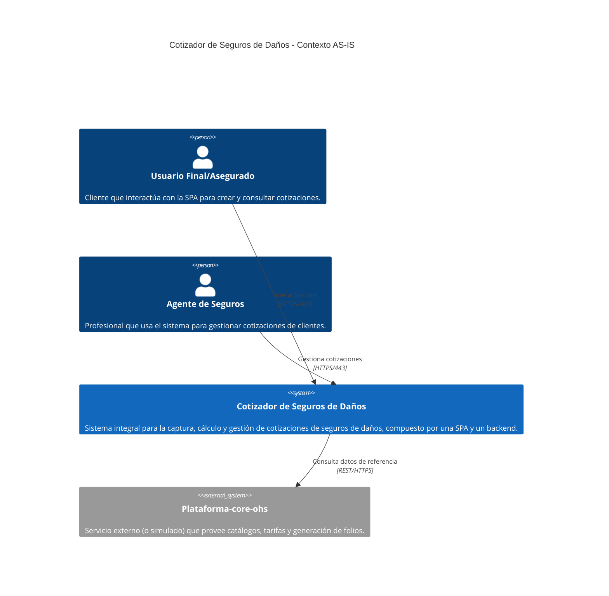
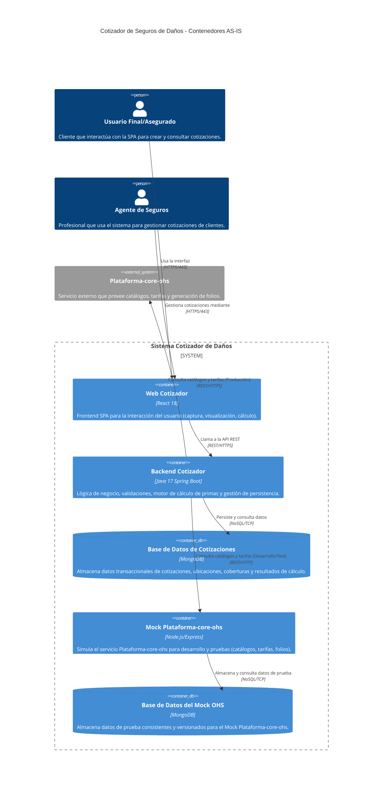

# Arquitectura AS-IS

### [1]. Diagrama de Contexto AS-IS (C1)

**Descripción**:
El sistema actual es un "Cotizador de Seguros de Daños", una aplicación integral diseñada para gestionar el ciclo de vida completo de las cotizaciones de seguros de daños. Su propósito principal es permitir a los usuarios, tanto finales como agentes de seguros, capturar información de cotizaciones, detallar ubicaciones de riesgo, configurar coberturas y calcular primas netas y comerciales de manera eficiente. La solución se compone de una interfaz web (SPA) y un backend principal.

Los elementos principales de este contexto incluyen a dos actores clave: el "Usuario Final/Asegurado", que interactúa directamente con la interfaz web para generar y consultar sus cotizaciones, y el "Agente de Seguros", quien utiliza el sistema para gestionar las cotizaciones de sus clientes. El sistema se apoya en un único sistema externo crítico, "Plataforma-core-ohs", para la obtención de datos maestros y funcionalidades esenciales para el cálculo de primas.

Un hallazgo clave en esta arquitectura AS-IS es la alta dependencia del sistema central en "Plataforma-core-ohs". Este servicio externo es la fuente de verdad para catálogos, tarifas y la generación de folios, lo que lo convierte en un punto crítico de fallo. Cualquier inestabilidad o latencia en "Plataforma-core-ohs" puede impactar severamente el rendimiento y la disponibilidad de funcionalidades esenciales del cotizador, como la creación de folios, la validación de códigos postales y el cálculo de primas, como se identifica en la matriz de riesgos.

**Análisis de Componentes**:

*   **Cotizador de Seguros de Daños**:
    *   **Descripción técnica**: Es el sistema principal del proyecto, una aplicación monolítica que encapsula tanto una interfaz de usuario web (SPA) para la interacción directa del usuario, como un backend robusto que contiene la lógica de negocio central, la gestión del ciclo de vida de las cotizaciones, el motor de cálculo de primas y la capa de persistencia. La persistencia se gestiona internamente, utilizando colecciones de datos como `cotizaciones_danos`, `parametros_calculo`, `tarifas_incendio`, `tarifas_cat`, `tarifa_fhm`, `factores_equipo_electronico`, `catalogo_cp_zonas`, entre otras, preferentemente en MongoDB.
    *   **Propósito**: Su objetivo es proporcionar una plataforma integral y eficiente para la creación, edición, cálculo y visualización de cotizaciones de seguros de daños, automatizando gran parte del proceso y asegurando la consistencia de los datos.
    *   **Observaciones**: El sistema es responsable de aplicar reglas de negocio complejas para el cálculo de primas y validaciones, así como de implementar mecanismos de versionado optimista y gestión de concurrencia. La calidad de la experiencia de usuario (RNF-001, RNF-009) y el rendimiento de las operaciones CRUD y de cálculo (RNF-002, RNF-003) son requerimientos no funcionales críticos para este componente.

*   **Plataforma-core-ohs**:
    *   **Descripción técnica**: Es un servicio externo que se expone a través de una API REST. Actúa como el proveedor central de datos maestros y funcionalidades esenciales para el "Cotizador de Seguros de Daños". Provee catálogos de suscriptores, agentes, giros, información de códigos postales y zonas de riesgo, catálogos de clasificación de riesgo y garantías, así como todas las tarifas y factores técnicos necesarios para el cálculo de primas (incendio, CAT, FHM, equipo electrónico). También es responsable de la generación de folios alfanuméricos únicos.
    *   **Propósito**: Suministrar información de referencia actualizada y consistente, así como servicios de apoyo para el funcionamiento del cotizador, evitando la duplicación de datos y lógica en el sistema principal.
    *   **Observaciones**: La dependencia de este servicio es "Crítica" (P=4, I=5) debido a su rol fundamental en la mayoría de las funcionalidades del cotizador. El sistema contempla la necesidad de un "mock server" robusto y versionado (FT-020) para el desarrollo y pruebas, lo que subraya la importancia de definir y gestionar su contrato de API. La resiliencia ante fallos de este servicio es un RNF clave (RNF-017).

**Análisis de Relaciones clave**:

*   **`Usuario Final/Asegurado` y `Agente de Seguros` con `Cotizador de Seguros de Daños`**:
    *   **Flujo**: Ambos actores interactúan directamente con la interfaz web del `Cotizador de Seguros de Daños` para crear, consultar, editar y calcular cotizaciones. El `Usuario Final` busca obtener su propia cotización, mientras que el `Agente de Seguros` gestiona múltiples cotizaciones para sus clientes.
    *   **Protocolo**: La comunicación se realiza a través del protocolo `HTTPS/443`, garantizando la seguridad en el tránsito de datos sensibles (RNF-005).
    *   **Riesgos**: Los riesgos asociados a esta relación se centran en la experiencia de usuario y el rendimiento. El RNF-001 (Tiempo de Respuesta de Interfaz de Usuario) y RNF-009 (Facilidad de Uso) son cruciales para la adopción y satisfacción. Un rendimiento deficiente o una interfaz compleja pueden llevar a la frustración y al abandono del sistema. La seguridad (RNF-007, Autenticación y Autorización) es vital para proteger el acceso a los datos de cotización y asegurados.

*   **`Cotizador de Seguros de Daños` con `Plataforma-core-ohs`**:
    *   **Flujo**: El `Cotizador de Seguros de Daños` realiza llamadas al servicio `Plataforma-core-ohs` para obtener datos de catálogos (suscriptores, agentes, giros, códigos postales, riesgos, garantías), tarifas y factores técnicos necesarios para el cálculo de primas, y para generar nuevos folios de cotización.
    *   **Protocolo**: La integración se realiza mediante una `API REST` sobre `HTTPS`, asegurando la comunicación cifrada (RNF-005).
    *   **Riesgos**: Esta relación es la principal fuente de riesgo externo. El "Fallo o inestabilidad en la integración con el servicio `Plataforma-core-ohs`" (Matriz de Riesgos - Crítico) es una preocupación mayor. Si este servicio no está disponible o es inestable, el cotizador no podrá generar nuevos folios, validar códigos postales o realizar cálculos de primas, lo que afectaría directamente la operatividad del sistema. El RNF-017 (Resiliencia ante Fallos del Servicio de Referencia) aborda esto, requiriendo mecanismos como reintentos y circuit breakers para mitigar el impacto. Además, la "Inconsistencia o errores en los datos de catálogos y tarifas" (Matriz de Riesgos - Medio) podría llevar a cálculos incorrectos si no se implementan validaciones robustas en la capa de integración.

---

Aquí se presenta el análisis de componentes AS-IS a nivel C2 (Contenedores) para el cotizador de seguros de daños, basado en la información proporcionada.

### [1]. Diagrama de Contenedores AS-IS (C2)

**Descripción**:
El diagrama de Contenedores AS-IS descompone el "Cotizador de Seguros de Daños" en sus principales componentes internos: una aplicación web (Frontend), un servicio de backend (Backend API), y una base de datos central. Además, se incluye un "Mock Server" con su propia base de datos, vital para el desarrollo y las pruebas, dada la dependencia del sistema de un servicio externo (`Plataforma-core-ohs`).

El "Web Cotizador" sirve como la interfaz de usuario principal, permitiendo a los usuarios interactuar con el sistema para gestionar cotizaciones. El "Backend Cotizador" centraliza la lógica de negocio, el motor de cálculo de primas, las validaciones y la persistencia de datos en la "Base de Datos de Cotizaciones". La interconexión con el servicio externo `Plataforma-core-ohs` es manejada por el backend, el cual, en entornos de desarrollo y pruebas, se comunica con el "Mock Plataforma-core-ohs" para simular las respuestas y dependencias externas.

Las limitaciones clave radican en la complejidad del motor de cálculo y la gestión de la consistencia de datos con versionado optimista, así como la resiliencia ante la posible inestabilidad del servicio externo `Plataforma-core-ohs`. La existencia de un mock server con su propia base de datos subraya la necesidad de aislar y controlar la dependencia externa durante el ciclo de desarrollo.

**Análisis de Componentes**:

*   **Web Cotizador**:
    *   **Descripción técnica**: Es una Single Page Application (SPA) implementada con React 18. Se encarga de la presentación de la interfaz de usuario, la captura de datos de cotizaciones, la visualización de ubicaciones de riesgo, la configuración de coberturas y la presentación de los resultados del cálculo de primas.
    *   **Propósito**: Proporcionar una experiencia de usuario fluida y eficiente para la creación y gestión de cotizaciones de daños, cumpliendo con los RNF-001 (Tiempo de Respuesta de Interfaz de Usuario) y RNF-009 (Facilidad de Uso).
    *   **Observaciones**: Actúa como el punto de entrada para los usuarios (`Usuario Final/Asegurado` y `Agente de Seguros`). Debe manejar validaciones de entrada básicas y mostrar alertas por datos incompletos o inválidos de forma interactiva (HU-118). La compatibilidad con navegadores (RNF-013) es un requisito clave.

*   **Backend Cotizador**:
    *   **Descripción técnica**: Un servicio de backend desarrollado con Java 17 y Spring Boot. Expone una API REST para ser consumida por el `Web Cotizador`. Contiene la lógica de negocio central, incluyendo la gestión del ciclo de vida de las cotizaciones, el motor de cálculo de primas, el motor de validación de reglas de negocio, y la capa de persistencia con control de concurrencia optimista.
    *   **Propósito**: Orquestar el proceso de cotización, aplicar reglas de negocio complejas, realizar cálculos financieros precisos (RNF-015), gestionar la persistencia de datos (RNF-002) y garantizar la integridad de la información (RNF-014). También es responsable de la integración con `Plataforma-core-ohs` (RNF-017).
    *   **Observaciones**: Este componente es el corazón del sistema, donde se implementan la mayoría de las funcionalidades críticas. La complejidad y la precisión de la lógica de cálculo (RNF-003, RNF-015) son riesgos clave. Se requiere una alta cobertura de pruebas (RNF-010, RNF-011) y monitoreo de errores (RNF-018).

*   **Base de Datos de Cotizaciones**:
    *   **Descripción técnica**: Una base de datos MongoDB. Almacena todas las cotizaciones de daños, incluyendo sus datos generales, múltiples ubicaciones de riesgo, configuraciones de coberturas, resultados financieros (prima neta, comercial, desglose por ubicación) y metadatos como la versión y la fecha de última actualización. También guarda parámetros de cálculo y tarifas internas si el backend las cachea o persiste.
    *   **Propósito**: Proporcionar persistencia robusta y escalable para los datos transaccionales del cotizador, soportando el versionado optimista (HU-147) y la atomicidad en la persistencia del cálculo (HU-171).
    *   **Observaciones**: La integridad de los datos (RNF-014) y el cifrado de datos sensibles en reposo (RNF-006) son requisitos de seguridad críticos. El esquema de datos debe ser diseñado para soportar la gestión de hasta 10 ubicaciones por cotización y la trazabilidad de los resultados del cálculo (HU-173).

*   **Mock Plataforma-core-ohs**:
    *   **Descripción técnica**: Un mock server, posiblemente implementado con Node.js/Express o un framework similar, que simula el comportamiento de `Plataforma-core-ohs`. Replicará los contratos de la API REST para catálogos (suscriptores, agentes, giros, CP, riesgo, garantías), tarifas y generación de folios.
    *   **Propósito**: Facilitar el desarrollo y las pruebas del `Backend Cotizador` sin depender de la disponibilidad o estabilidad del servicio externo real. Permite la configuración de respuestas dinámicas y escenarios de error controlados (HU-197) para probar la resiliencia del sistema.
    *   **Observaciones**: Es un componente crítico para mitigar el riesgo de dependencia del servicio externo (Matriz de Riesgos - Crítico). Su propia base de datos (`Base de Datos del Mock OHS`) debe ser poblada con datos de prueba consistentes y versionados (HU-198).

*   **Base de Datos del Mock OHS**:
    *   **Descripción técnica**: Una base de datos MongoDB utilizada por el `Mock Plataforma-core-ohs`. Contiene los datos de prueba necesarios para simular los catálogos y tarifas que `Plataforma-core-ohs` proporcionaría. Se gestiona mediante migraciones (ej. Flyway para NoSQL) para mantener la consistencia y el versionado de los datos de prueba (HU-198).
    *   **Propósito**: Proporcionar al `Mock Plataforma-core-ohs` los datos necesarios para simular respuestas realistas y variadas, permitiendo pruebas exhaustivas del `Backend Cotizador` en diferentes escenarios de datos.
    *   **Observaciones**: La consistencia de estos datos es crucial para la fiabilidad de las pruebas. La capacidad de poblar y actualizar esta base de datos de forma controlada es fundamental para el ciclo de desarrollo.

**Análisis de Relaciones clave**:

*   **`Web Cotizador` con `Backend Cotizador`**:
    *   **Flujo**: El `Web Cotizador` realiza llamadas a la API REST del `Backend Cotizador` para todas las operaciones de negocio: crear/cargar/editar cotizaciones, agregar/editar/eliminar ubicaciones, configurar coberturas, iniciar cálculos de prima y consultar resultados.
    *   **Protocolo**: `REST/HTTPS`. El uso de HTTPS (RNF-005) asegura el cifrado de datos sensibles en tránsito.
    *   **Riesgos**: La latencia en las llamadas a la API afecta directamente el RNF-001 (Tiempo de Respuesta de Interfaz de Usuario) y RNF-002 (Tiempo de Respuesta de Operaciones CRUD). Los errores en la comunicación o en la lógica de negocio del backend deben ser manejados con mensajes claros para el usuario (HU-153).

*   **`Backend Cotizador` con `Base de Datos de Cotizaciones`**:
    *   **Flujo**: El `Backend Cotizador` realiza operaciones de persistencia (guardar, actualizar, eliminar) y consulta sobre las colecciones de MongoDB para gestionar las cotizaciones y sus datos asociados.
    *   **Protocolo**: `NoSQL/TCP`.
    *   **Riesgos**: La eficiencia de las consultas y actualizaciones es clave para el rendimiento general del sistema (RNF-002). La implementación del versionado optimista (HU-147) y la persistencia atómica (HU-171) son fundamentales para la integridad de datos (RNF-014), evitando conflictos de concurrencia y pérdida de información.

*   **`Backend Cotizador` con `Plataforma-core-ohs` (Producción)**:
    *   **Flujo**: En el entorno de producción, el `Backend Cotizador` consulta `Plataforma-core-ohs` para obtener catálogos dinámicos (suscriptores, agentes, giros, CP, riesgo, garantías), tarifas y factores técnicos esenciales para el cálculo de primas.
    *   **Protocolo**: `REST/HTTPS`.
    *   **Riesgos**: Esta es la principal dependencia externa. El "Fallo o inestabilidad en la integración con el servicio `Plataforma-core-ohs`" (Matriz de Riesgos - Crítico) es el riesgo más alto. La resiliencia (RNF-017) es crucial, requiriendo mecanismos de reintento, circuit breaker y posiblemente caché (HU-204) para mitigar el impacto de latencias o fallos del servicio externo. Las inconsistencias en los datos recibidos (Matriz de Riesgos - Medio) también representan un riesgo para la precisión del cálculo (RNF-015).

*   **`Backend Cotizador` con `Mock Plataforma-core-ohs` (Desarrollo/Test)**:
    *   **Flujo**: Durante el desarrollo y las pruebas, el `Backend Cotizador` se configura para comunicarse con el `Mock Plataforma-core-ohs` en lugar del servicio real. Esto permite la simulación de todas las interacciones con el servicio externo.
    *   **Protocolo**: `REST/HTTP` (asumiendo un entorno local o de desarrollo donde HTTPS podría ser opcional para el mock).
    *   **Riesgos**: Aunque diseñado para mitigar riesgos, la calidad del mock server es vital. Si el `Mock Plataforma-core-ohs` no simula fielmente el comportamiento del servicio real (HU-196) o es inestable bajo carga de prueba (HU-199), podría llevar a pruebas ineficaces y la introducción de errores en producción.

*   **`Mock Plataforma-core-ohs` con `Base de Datos del Mock OHS`**:
    *   **Flujo**: El `Mock Plataforma-core-ohs` consulta su `Base de Datos del Mock OHS` para obtener los datos predefinidos de catálogos y tarifas que utiliza para responder a las solicitudes del `Backend Cotizador`.
    *   **Protocolo**: `NoSQL/TCP`.
    *   **Riesgos**: La consistencia y la representatividad de los datos en la `Base de Datos del Mock OHS` son importantes. Datos de prueba incorrectos o desactualizados podrían llevar a que las pruebas no detecten problemas reales en la lógica del `Backend Cotizador`. La gestión de migraciones (HU-198) es clave para mantener la calidad de estos datos.

---

Aquí se presenta el análisis de componentes AS-IS a nivel de Capacidades de Negocio para el cotizador de seguros de daños, basado en la información proporcionada y los análisis C1 y C2 previos.

### [1]. Mapa de Capacidades AS-IS

**Descripción**:
El mapa de capacidades AS-IS del Cotizador de Seguros de Daños ilustra las funcionalidades principales que el sistema está diseñado para soportar, aquellas que presentan limitaciones y las que están ausentes en el alcance actual. El propósito de este mapa es proporcionar una visión clara de las capacidades funcionales y no funcionales del sistema, identificando fortalezas y áreas de mejora.

Las capacidades principales se centran en la **Gestión Integral de Cotizaciones**, abarcando desde la creación y edición de datos generales y ubicaciones de riesgo, hasta la configuración de coberturas y la gestión de su ciclo de vida con un robusto control de concurrencia. El **Cálculo de Primas** es otra capacidad central, que incluye la ejecución, el motor de cálculo de primas netas y comerciales, y la visualización detallada de resultados, aunque con la limitación explícita de basarse en fórmulas simplificadas y no actuariales reales. La **Integración y Gestión de Datos Maestros** es fundamental, destacando la capacidad de consumir diversos catálogos y tarifas de un servicio externo (o su simulación), junto con una capa de validación y gestión de caché.

Los hallazgos clave incluyen una sólida base en la gestión transaccional y la resiliencia ante fallos externos mediante la simulación de servicios. Sin embargo, se identifican gaps en funcionalidades avanzadas de seguridad (como la autenticación multifactor) y en la exhaustividad del historial de cambios de las cotizaciones. La precisión del cálculo, aunque robusta para las fórmulas definidas, no alcanza un nivel actuarial real, lo que representa una limitación consciente del proyecto. La gestión de caché, aunque implementada, carece de invalidación por eventos en la primera versión.

```mermaid
mindmap
  root((🏢 Cotizador de Seguros de Daños<br/>Capacidades AS-IS))
    📋 Gestión de Cotizaciones
      ✅ Creación y Edición General
        Iniciar nueva cotización con folio automático
        Cargar y editar cotización existente por folio
        Capturar y validar datos del asegurado (nombre, RFC)
        Seleccionar tipo de seguro, moneda y canal de venta de catálogos
        Establecer y validar vigencia
      ✅ Gestión de Ubicaciones de Riesgo
        Agregar nuevas ubicaciones (hasta 10)
        Editar detalles específicos de ubicación (dirección, uso, características)
        Eliminar ubicaciones
        Visualizar múltiples ubicaciones
        Consultar y validar código postal de ubicación
        Visualizar alertas por datos incompletos en ubicaciones
      ✅ Configuración de Coberturas
        Visualizar catálogo de coberturas por tipo de seguro y ubicación
        Seleccionar y deseleccionar coberturas por ubicación
        Configurar parámetros específicos de cobertura (sumas aseguradas, deducibles)
        Visualizar resumen de coberturas activas por ubicación
      ✅ Ciclo de Vida y Estados
        Iniciar en estado "Borrador"
        Actualizar a "Calculada" tras cálculo exitoso
        Cambiar manualmente a "Aprobada" o "Rechazada"
        Establecer estado "Emitida"
        Visualizar estado actual de la cotización
        Restricción - No calcular sin validaciones previas
        Restricción - No aprobar sin cálculo previo
        Restricción - Cualquier modificación invalida cálculo
      ✅ Control de Concurrencia y Versionado
        Campo de versión incremental
        Actualización de fecha de última modificación
        Detección de conflictos de concurrencia
        Notificación de conflicto al usuario
        Permitir recargar última versión de cotización
        Actualización parcial de campos
    📊 Cálculo de Primas
      ✅ Ejecución del Cálculo
        Iniciar proceso de cálculo
        Calcular prima neta y comercial total
        Calcular y mostrar prima por cada ubicación
        Aplicar factores técnicos y reglas de negocio
      ✅ Motor Central de Cálculo
        Cálculo de Prima Neta por Ubicación
        Aplicación de Factores CAT y FHM
        Cálculo de Prima Comercial Total
        Generación de desglose de primas por ubicación
        Cálculo de Prima de Incendio
        Cálculo de Prima de Equipo Electrónico
      ⚠️ Precisión de Cálculo
        Basado en fórmulas simplificadas y documentadas
        NO incluye lógica actuarial real compleja
      ✅ Visualización de Resultados
        Visualizar resumen de prima neta y comercial total
        Visualizar desglose de prima por ubicación
        Visualizar componentes adicionales (impuestos, recargos básicos)
        Sincronizar resultados financieros con el último cálculo
      ✅ Persistencia y Trazabilidad de Resultados
        Persistencia de resultados en cotización
        Atomicidad en la persistencia del cálculo
        Actualización de metadatos de cotización (fecha, versión)
        Registro de parámetros para trazabilidad del cálculo
    ⚙️ Gestión de Reglas y Validaciones
      ✅ Motor de Validación de Reglas de Negocio
        Validación de Rangos de Suma Asegurada
        Validación de Código Postal y Zona
        Verificación de Datos Mínimos por Ubicación
      ✅ Provisión de Mensajes de Error
        Generación de Mensajes de Error Claros
        Bloqueo de Cálculo por Errores de Validación
      ✅ Trazabilidad de Reglas de Negocio
        Documentar y trazar las reglas de negocio
    🔗 Integración y Datos Maestros
      ✅ Generación y Gestión de Folios
        Generar folio alfanumérico único (PREFIJO-AAAA-NNNNNN)
        Persistir secuencia de folios de forma segura
        Implementar reintentos en generación de folio
        Notificar fallo persistente de generación de folio
        Asegurar idempotencia en generación de folios
        Manejar concurrencia en generación de folios
      ✅ Conectividad y Consumo de Catálogos Básicos
        Conectar a servicio de catálogos básicos
        Recuperar catálogo de Suscriptores, Agentes y Giros
        Mapear y transformar datos de catálogos básicos
        Manejar errores y reintentos de conectividad
      ✅ Integración de Catálogo de Códigos Postales y Zonas
        Consultar información de Código Postal y Zona
        Validar Código Postal
        Mapear información de zonas de código postal
      ✅ Integración de Catálogos de Riesgo y Garantías
        Recuperar catálogo de Clasificación de Riesgo
        Recuperar catálogo de Garantías
        Mapear datos de clasificación de riesgo y garantías
        Reflejar cambios de catálogos en cotizador
      ✅ Conectividad y Consumo de Tarifas y Factores Técnicos
        Consultar Tarifas de Incendio, CAT, FHM y Factores de Equipo Electrónico
        Mapear tarifas y factores técnicos
        Manejar errores y ausencia de datos en tarifas
      ✅ Capa de Validación de Datos Maestros
        Implementar reglas de validación de datos maestros
        Registrar inconsistencias detectadas
        Aplicar corrección automática de inconsistencias
        Notificar inconsistencias que requieren intervención
        Definir reglas de validación con analistas funcionales
      ✅ Gestión de Caché y Estrategia de Actualización
        Almacenar datos maestros en caché
        Asegurar acceso más rápido a datos en caché
        Implementar mecanismo de invalidación/actualización de caché (TTL)
        Mantener consistencia de datos en caché
        Monitorear rendimiento y consistencia del caché
      ⚠️ Invalidación de Caché por Eventos
        No implementada en primera versión, solo TTL
      ✅ Simulación de Servicio Externo (Plataforma-core-ohs)
        Configurar Mock Server Base
        Simular Endpoints de Catálogos Básicos
        Simular Endpoints de Códigos Postales y Zonas
        Simular Endpoints de Clasificación de Riesgo y Garantías
        Simular Endpoints de Tarifas y Factores Técnicos
        Poblar Base de Datos del Mock con Migraciones
        Configurar respuestas dinámicas y errores en el mock
        Validar estabilidad del mock server con pruebas de carga
    🔐 Seguridad
      ✅ Autenticación y Autorización Básica
        Autenticación interna con usuario y contraseña
        Autorización basada en roles
      ❌ Multi-Factor Avanzado
        SMS OTP
        Biométrico
        Tokens Hardware
      ✅ Cifrado de Datos
        Cifrado de datos sensibles en tránsito (TLS 1.2+)
        Cifrado de datos sensibles en reposo (AES-256)
    📈 Rendimiento y Escalabilidad
      ✅ Tiempos de Respuesta
        Interfaz de Usuario (< 500ms, carga inicial < 2s)
        Operaciones CRUD Backend (< 1.5s)
        Cálculo de Prima (< 3s para 10 ubicaciones)
      ✅ Escalabilidad
        Soporte de 500 usuarios concurrentes
      ✅ Resiliencia ante Fallos Externos
        Manejo de interrupciones o latencias de Plataforma-core-ohs
        Mecanismos de reintento con backoff y circuit breaker
        Funcionalidad degradada con mensaje amigable
    📋 Calidad y Mantenibilidad
      ✅ Cobertura de Pruebas
        Unitarias (Backend y Frontend > 80%)
        Automatizadas de flujos críticos (mínimo 3 flujos)
      ✅ Documentación Técnica
        Especificaciones ASSD
        Diagramas de arquitectura (C4 Model)
        Modelo de datos
        Descripción lógica de cálculo
      ✅ Monitoreo y Trazabilidad de Errores
        Registro de errores con detalles y contexto
        Identificador de correlación para transacciones
        Sistema de logging centralizado
      ⚠️ Historial de Cambios Detallado
        Registro de versión y fecha de última actualización
        Consideración de historial para campos críticos (no totalmente implementado)
    🖥️ Usabilidad y Compatibilidad
      ✅ Facilidad de Uso
        Interfaz intuitiva y eficiente
        Proceso de creación de cotización en < 5 minutos (primera interacción)
      ✅ Compatibilidad con Navegadores
        Dos últimas versiones estables de Chrome, Firefox, Edge, Safari

```

**Análisis de Capacidades**:

*   **Precisión de Cálculo**: **⚠️ Limitada**
    *   **Descripción**: El sistema es capaz de calcular la prima neta y comercial total, así como el desglose por ubicación, aplicando factores técnicos y reglas de negocio.
    *   **Limitaciones**: La precisión del cálculo está garantizada al 100% *según las fórmulas simplificadas y documentadas*, pero no incorpora una lógica actuarial real compleja. Esto significa que, si bien es exacto para el modelo definido, no replica la complejidad completa de un cálculo actuarial de seguros.
    *   **Impacto**: Potencialmente, los resultados podrían no ser tan sofisticados como los de un sistema actuarial completo, lo que podría requerir ajustes manuales o complementos externos para escenarios de alta complejidad.

*   **Invalidación de Caché por Eventos**: **⚠️ Limitada**
    *   **Descripción**: El sistema implementa una gestión de caché para los datos maestros con una política de invalidación basada en Tiempo de Vida (TTL).
    *   **Limitaciones**: La primera versión del sistema no incluye un mecanismo de invalidación de caché bajo demanda o por eventos de actualización desde `Plataforma-core-ohs`. Esto implica que los datos se refrescarán solo al expirar su TTL o mediante una actualización programada.
    *   **Impacto**: Podría haber una ventana de tiempo en la que el cotizador opere con datos maestros ligeramente desactualizados si los cambios en la fuente externa ocurren entre los intervalos de TTL o las actualizaciones programadas. Para cambios críticos y urgentes, se requeriría una intervención manual para forzar la invalidación.

*   **Multi-Factor Avanzado (MFA)**: **❌ Ausente**
    *   **Descripción**: El sistema implementa autenticación interna con gestión de usuarios propia basada en credenciales (usuario/contraseña) y autorización basada en roles.
    *   **Limitaciones**: No se menciona la implementación de métodos de autenticación multifactor avanzados como SMS OTP, biometría o tokens de hardware.
    *   **Impacto**: La ausencia de MFA reduce el nivel de seguridad de la autenticación, dejando el sistema más vulnerable a ataques de phishing o robo de credenciales. Podría no cumplir con futuras normativas de seguridad más estrictas o con las expectativas de seguridad de los usuarios para aplicaciones que manejan datos sensibles.

*   **Historial de Cambios Detallado de Cotización**: **⚠️ Limitada**
    *   **Descripción**: El sistema registra un número de versión incremental y la fecha de última actualización para cada cotización. Se considera el registro de parámetros clave para la trazabilidad de los cálculos.
    *   **Limitaciones**: Si bien hay un control de versión básico y trazabilidad para el cálculo, no se especifica un historial de cambios detallado que permita ver *qué* campos específicos fueron modificados en cada versión de la cotización, más allá de los metadatos de actualización. RNF-019 menciona "se considerará la implementación de un historial de cambios para campos críticos", lo que sugiere que no es una capacidad totalmente implementada en el estado actual.
    *   **Impacto**: Dificultad para auditar de manera granular los cambios realizados en una cotización a lo largo del tiempo, lo que podría complicar la resolución de disputas, la depuración de errores o la comprensión de la evolución de una cotización específica por parte de los analistas o auditores.