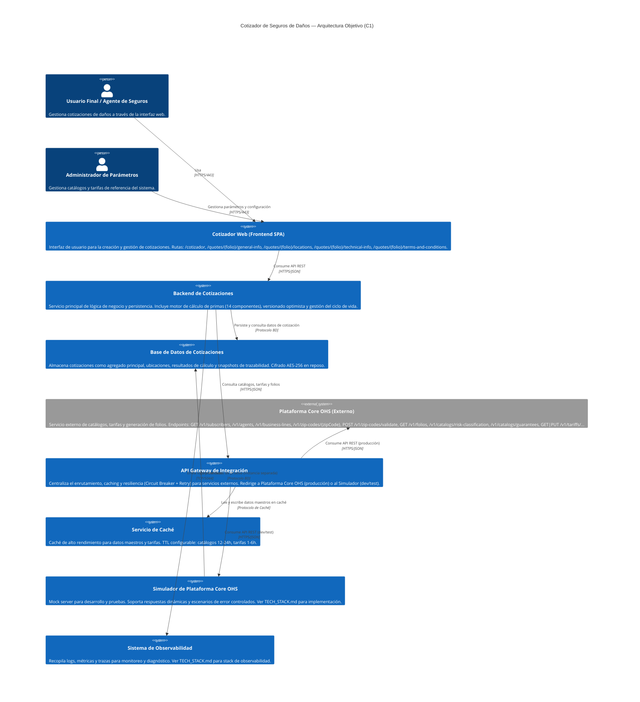
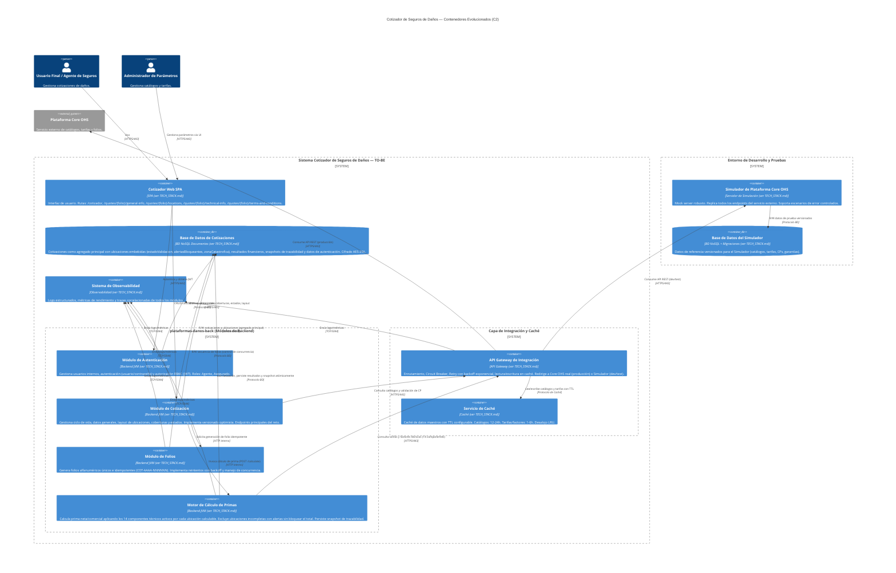
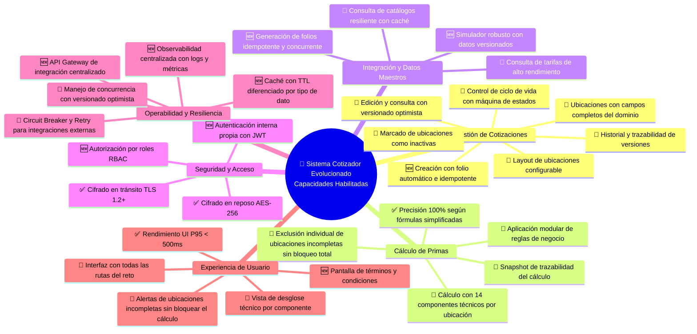

# Arquitectura Evolucionada (TO-BE) — Cotizador de Seguros de Daños

> **Nota sobre el stack tecnológico**: Las versiones específicas, frameworks, bibliotecas y herramientas de implementación están centralizados en **TECH_STACK.md**. Las etiquetas de tecnología en los diagramas C4 (tercer parámetro de `Container`) apuntan a ese archivo. Este documento define la arquitectura; TECH_STACK.md define con qué se construye.

---

## [C1] Diagrama de Contexto Evolucionado

**Descripción**:
Este diagrama presenta la arquitectura objetivo del Cotizador de Seguros de Daños, mostrando cómo el sistema evoluciona para abordar los desafíos de negocio y técnicos identificados. Se conservan los roles de usuario principales y el sistema externo `Plataforma Core OHS`, pero la forma en que el sistema interactúa con ellos evoluciona significativamente.

El `Cotizador Web (Frontend SPA)` y el `Backend de Cotizaciones` son los componentes clave que se refactorizan y mejoran. Se introduce un `API Gateway de Integración` para centralizar y robustecer la comunicación con `Plataforma Core OHS` tanto en producción (servicio real) como en desarrollo/pruebas (simulador). Un `Servicio de Caché` y un `Sistema de Observabilidad` completan la arquitectura.

> **Nota sobre el diagrama**: La sintaxis `C4Context` requiere la librería C4-PlantUML o el soporte C4 de Mermaid. Si el entorno no la soporta, los diagramas pueden renderizarse como flowcharts equivalentes.

**Análisis de Evolución de Componentes (C1):**

---

### Usuario Final / Agente de Seguros
- **Estrategia**: ✅ Keep
- **AS-IS**: Usuario que interactúa con el sistema para cotizar manualmente.
- **Cambio TO-BE**: Mismo rol, pero con una experiencia mejorada: interfaz más intuitiva, cálculo en <3s, alertas de ubicaciones incompletas sin bloquear el proceso completo (RFR-008), y gestión visual del ciclo de vida de la cotización.
- **Justificación**: Actor principal del negocio, su eficiencia impacta directamente los KPIs de EP-001 (cotización < 10 min, SUS > 80).
- **Impacto**: Mayor satisfacción, reducción del tiempo de cotización, menor tasa de error en captura de datos (<5%).

---

### Administrador de Parámetros
- **Estrategia**: ✅ Keep
- **AS-IS**: Gestión manual de catálogos y tarifas (carga de archivos o ingreso directo).
- **Cambio TO-BE**: Interactúa con el frontend (SPA) y el backend para gestionar catálogos y tarifas, que se integran con `Plataforma Core OHS` a través del API Gateway y se sirven desde caché.
- **Justificación**: Rol clave para la configuración del negocio (EP-003: reducir esfuerzo manual en gestión de datos maestros).
- **Impacto**: Eliminación de procesos manuales, datos más frescos y consistentes, menor esfuerzo operativo.

---

### Cotizador Web (Frontend SPA) — `cotizador-danos-web`
- **Estrategia**: 🔄 Evolve
- **AS-IS**: Interfaz SPA básica para captura de cotizaciones.
- **Cambio TO-BE**: Evolucionado con las siguientes capacidades:
  - Gestión dinámica de hasta 10 ubicaciones con campos completos del dominio (RFR-002, HU-006, HU-007 del bloque 1; HU-115, HU-116, HU-118 del bloque 2).
  - Layout de ubicaciones configurable (`configuracionLayout`) — nueva ruta `/quotes/{folio}/locations` (RFR-009, HU-114).
  - Cálculo con alerta por ubicaciones incompletas sin bloqueo total (RFR-008, HU-015 bloque 1; HU-125 bloque 2).
  - Vista de desglose técnico por los 14 componentes — ruta `/quotes/{folio}/technical-info` (HU-057 bloque 1; HU-134 bloque 2).
  - Pantalla de términos y condiciones — ruta `/quotes/{folio}/terms-and-conditions` (HU-143 bloque 2).
  - Gestión visual del ciclo de vida: estados Borrador → Calculada → Aprobada/Rechazada → Emitida (HU-028 bloque 1; HU-142 bloque 2).
  - Manejo de conflictos de concurrencia con notificación y recarga (QAS-006).
- **Justificación**: Mejorar Capacidad de Interacción (QA-006) y Rendimiento UI (RNF-001).
- **Impacto**: Interfaz más intuitiva y rápida, reducción de errores en captura, flujo de cotización completo en < 10 min.

---

### Backend de Cotizaciones — `plataformas-danos-back`
- **Estrategia**: 🔄 Evolve
- **AS-IS**: Backend identificado como "God Component" con toda la lógica centralizada.
- **Cambio TO-BE**: Refactorizado con responsabilidades claramente separadas en módulos internos (o microservicios en una evolución futura):
  - Motor de cálculo modular para los 14 componentes técnicos (RFR-003, CON-001, HU-041 bloque 1; HU-175 bloque 2).
  - Versionado optimista con campo `version` incremental (RFR-006, CON-003, HU-035, HU-062, HU-064 bloque 1; HU-149, HU-180, HU-182 bloque 2).
  - Gestión del ciclo de vida con máquina de estados (RFR-007, HU-024 a HU-028 bloque 1; HU-135 a HU-142 bloque 2).
  - Exclusión selectiva de ubicaciones incompletas sin bloqueo total del cálculo (RFR-008, HU-169 bloque 2).
  - Snapshot de trazabilidad del cálculo embebido en el documento de cotización (RFR-010, HU-063 bloque 1; HU-179 bloque 2).
  - Cifrado AES-256 en datos sensibles, JWT + RBAC para autenticación y autorización (RNF-005, RNF-006, RNF-007).
  - Envío de logs y métricas al Sistema de Observabilidad (CON-006).
- **Justificación**: Resolver el anti-patrón "God Component", mejorar Mantenibilidad (QA-004), Rendimiento (RNF-002, RNF-003) y Fiabilidad (QA-003).
- **Impacto**: Mayor estabilidad, escalabilidad, cálculos precisos para los 14 componentes, gestión robusta de concurrencia y trazabilidad completa.

---

### Base de Datos de Cotizaciones
- **Estrategia**: 🔄 Evolve
- **AS-IS**: Base de datos NoSQL de documentos para persistencia básica de cotizaciones.
- **Cambio TO-BE**:
  - Esquema de agregado principal con ubicaciones embebidas (CON-004) que incluyen todos los campos del dominio: `estadoValidacion` (COMPLETA / INCOMPLETA / INACTIVA), `alertasBloqueantes`, `zonaCatastrofica`, `giro.claveIncendio`, `garantías[]`, etc.
  - Campo `version` incremental para versionado optimista (CON-003).
  - Snapshot de trazabilidad embebido con parámetros de entrada, identificadores de tarifas y valores por componente (RFR-010).
  - Cifrado AES-256 en reposo para datos sensibles de asegurados y ubicaciones (CON-005, RNF-006).
  - Las ubicaciones **nunca se eliminan físicamente**; se marcan con `estadoValidacion: INACTIVA` (RFR-002, CON-007).
- **Justificación**: Cumplir restricción de base de datos NoSQL de documentos (RT-001), mejorar Fiabilidad (QAS-006) y Seguridad (QAS-004).
- **Impacto**: Integridad y trazabilidad garantizadas, historial preservado, datos sensibles protegidos.

---

### Plataforma Core OHS (Externo)
- **Estrategia**: ✅ Keep (el sistema externo no cambia; cambia la capa de integración)
- **AS-IS**: Dependencia crítica directa para catálogos, tarifas y folios.
- **Cambio TO-BE**: La interacción se realiza a través del API Gateway de Integración, que añade resiliencia (Circuit Breaker, Retry con backoff exponencial), caching con TTL y orquestación. Esto elimina los anti-patrones "Chatty Communication" y "Temporal Coupling".
- **Justificación**: Dependencia externa fuera de nuestro control. La evolución se centra en la capa de integración propia.
- **Impacto**: El fallo o latencia de `Plataforma Core OHS` ya no paraliza el cotizador; el sistema degrada funcionalmente con datos en caché y mensajes amigables.

---

### API Gateway de Integración
- **Estrategia**: 🆕 New
- **AS-IS**: No existía — el backend llamaba directamente al servicio externo.
- **Cambio TO-BE**: Gateway de integración que centraliza: enrutamiento inteligente (producción → Core OHS real; dev/test → Simulador), Circuit Breaker, Retry con backoff, lectura/escritura en caché, y envío de métricas al sistema de observabilidad (OPT-004, CON-002). Ver TECH_STACK.md para implementación específica.
- **Justificación**: Resolver anti-patrón "God Component" en el backend y problemas de latencia/resiliencia (PAC-002, OPT-004, IMP-002).
- **Impacto**: Mayor resiliencia, mejor rendimiento en integración, backend más limpio y mantenible.

---

### Servicio de Caché
- **Estrategia**: 🆕 New
- **AS-IS**: Sin caché centralizada para datos externos.
- **Cambio TO-BE**: Caché en memoria local en primera versión, escalable a caché distribuida si se requiere distribución. TTL diferenciado: catálogos estáticos 12-24h, tarifas/factores 1-6h. Desalojo LRU con tamaño limitado. Sin invalidación por eventos en primera versión (OPT-001, CON-002, PAC-006, BC-006). Ver TECH_STACK.md para implementación específica.
- **Justificación**: Reducir latencia y carga sobre `Plataforma Core OHS` (anti-patrón "Chatty Communication").
- **Impacto**: Reducción de latencia en consulta de datos maestros en 50-90%, mayor throughput, mayor disponibilidad ante fallos del servicio externo.

---

### Simulador de Plataforma Core OHS
- **Estrategia**: 🆕 New
- **AS-IS**: Simulación ad-hoc o ausente.
- **Cambio TO-BE**: Servidor de simulación dedicado y robusto que:
  - Replica fielmente los contratos REST de `Plataforma Core OHS` (todos los endpoints del reto).
  - Usa base de datos de prueba con migraciones de datos versionadas (RT-012).
  - Soporta respuestas dinámicas y escenarios de error controlados para pruebas (BC-003, OOS-002).
  - El API Gateway lo consume automáticamente en entornos dev/test.
  - Ver TECH_STACK.md para implementación específica del mock server.
- **Justificación**: Acelerar el desarrollo y garantizar pruebas consistentes e independientes del servicio real (EP-003, BC-003).
- **Impacto**: Mayor agilidad en desarrollo, pruebas fiables, cero dependencia del servicio externo real en entornos no productivos.

---

### Sistema de Observabilidad
- **Estrategia**: 🆕 New
- **AS-IS**: Sin monitoreo centralizado.
- **Cambio TO-BE**: Stack de observabilidad centralizado para logs estructurados, métricas de rendimiento y trazas correlacionadas con IDs de correlación por solicitud (CON-006). Ver TECH_STACK.md para implementación específica.
- **Justificación**: Mejorar Mantenibilidad (QA-004) y facilitar diagnóstico en producción. Soportar la trazabilidad del cálculo exigida por el reto (PAC-007, RFR-010).
- **Impacto**: Detección temprana de problemas, diagnóstico eficiente, visibilidad del rendimiento, soporte para auditorías.

---

**Brechas del AS-IS cerradas por esta arquitectura:**

| Brecha | Solución TO-BE |
|---|---|
| Gestión manual de datos maestros (catálogos, tarifas) | API Gateway + Caché con TTL + Simulador robusto |
| Inconsistencias y errores en cálculos de primas | Motor de cálculo modular con 14 componentes, >90% cobertura unitaria |
| Cotizaciones lentas (>10 min, cálculo >3s) | Caché de tarifas, motor optimizado, Frontend SPA optimizado |
| Pérdida de datos en ediciones concurrentes | Versionado optimista con campo `version`, detección de conflicto y recarga |
| Falta de trazabilidad y auditabilidad | Snapshot de trazabilidad embebido + Sistema de Observabilidad |
| Fallo del sistema Core bloquea todo el cotizador | Circuit Breaker + Retry + Caché de fallback + funcionalidad degradada |
| "God Component" en el backend | Módulos especializados: motor de cálculo, generación de folios, gestión de estados |
| Sin comportamiento definido para ubicaciones incompletas | RFR-008: exclusión individual sin bloqueo del cálculo total |

---

## [C2] Diagrama de Contenedores Evolucionados

**Descripción**:
Este diagrama detalla la arquitectura TO-BE descomponiendo los sistemas en sus contenedores individuales. El `plataformas-danos-back` evoluciona hacia módulos especializados dentro de una arquitectura de backend con responsabilidades bien delimitadas.

> **Decisión de implementación**: Para el alcance del reto técnico, los módulos de backend (Auth, Cotización, Folio, Motor de Cálculo) pueden implementarse como **módulos dentro de un único servicio backend (monolito modular)** o como microservicios independientes. La arquitectura está diseñada para soportar ambos enfoques. Ver TECH_STACK.md para el framework específico.

**Análisis de Evolución de Contenedores (C2):**

---

### Cotizador Web SPA — `cotizador-danos-web`
- **Estrategia**: 🔄 Evolve
- **Cambio**: Aplicación web SPA con rutas definidas para todas las pantallas del reto, gestión dinámica de ubicaciones con todos los campos del dominio, alertas de ubicaciones incompletas, desglose técnico por los 14 componentes, pantalla de términos y condiciones, manejo de conflictos de concurrencia. Ver TECH_STACK.md para framework y versión.
- **HUs clave (bloque 1)**: HU-006, HU-007, HU-010, HU-015, HU-020, HU-021, HU-028.
- **HUs clave (bloque 2)**: HU-114 (layout), HU-115, HU-116, HU-117, HU-125, HU-130, HU-131, HU-134 (technical-info), HU-142, HU-143 (terms), HU-183, HU-184.
- **Impacto**: Experiencia de usuario completa y alineada con el escenario de aceptación del reto.

---

### Módulo de Autenticación
- **Estrategia**: 🆕 New
- **Cambio**: Extraído del "God Component". Gestiona usuarios propios (sin SSO), autenticación con usuario/contraseña, emisión y validación de JWT, y control de acceso por roles (Agente, Asegurado) conforme a BC-007 y RT-014. Ver TECH_STACK.md para framework específico.
- **HUs clave**: RF-009 (Autenticación), RF-011 (Roles) del RF corregido.
- **Impacto**: Seguridad explícita y modular. Base para futura integración SSO (OOS-005).

---

### Módulo de Cotización — núcleo de `plataformas-danos-back`
- **Estrategia**: 🔄 Evolve
- **Cambio**: Gestiona el ciclo de vida completo de la cotización. Implementa todos los endpoints mínimos del reto: `PUT /v1/quotes/{folio}/general-info`, `GET/PUT /v1/quotes/{folio}/locations/layout`, `GET/PUT /v1/quotes/{folio}/locations`, `PATCH /v1/quotes/{folio}/locations/{índice}`, `GET /v1/quotes/{folio}/locations/summary`, `GET /v1/quotes/{folio}/state`, `GET/PUT /v1/quotes/{folio}/coverage-options`. Incluye la regla de no-eliminación de ubicaciones (solo `estadoValidacion: INACTIVA`) y el versionado optimista.
- **HUs clave (bloque 1)**: HU-001, HU-002, HU-003, HU-004, HU-005, HU-006, HU-007, HU-008, HU-024 a HU-028, HU-035, HU-036, HU-037, HU-038.
- **HUs clave (bloque 2)**: HU-109 a HU-143, HU-149 a HU-153.
- **Impacto**: Backend que cubre el 100% del alcance funcional obligatorio del reto.

---

### Módulo de Folios
- **Estrategia**: 🆕 New (extraído como módulo especializado)
- **Cambio**: Responsabilidad única: generar folios alfanuméricos únicos (patrón `COT-AAAA-NNNNNN`), con idempotencia, reintentos automáticos configurables y manejo de concurrencia para evitar duplicados bajo carga.
- **HUs clave (bloque 1)**: HU-086, HU-087, HU-088, HU-089, HU-090, HU-091.
- **Impacto**: Unicidad e integridad del identificador de cotización garantizadas bajo cualquier condición de carga.

---

### Motor de Cálculo de Primas
- **Estrategia**: 🔄 Evolve (extraído como módulo especializado)
- **Cambio**: Implementa el endpoint `POST /v1/quotes/{folio}/calculate`. Lógica modular para los 14 componentes técnicos (Incendio edificios, Incendio contenidos, Extensión de cobertura, CAT TEV, CAT FHM, Remoción de escombros, Gastos extraordinarios, Pérdida de rentas, BI, Equipo electrónico, Robo, Dinero y valores, Vidrios, Anuncios luminosos). Solo aplica componentes activos según `opcionesCobertura` y `garantías[]`. **Excluye individualmente las ubicaciones con `estadoValidacion: INCOMPLETA` sin bloquear el cálculo total** (RFR-008). Persiste `primaNeta`, `primaComercial` y `primasPorUbicacion[]` de forma atómica con snapshot de trazabilidad. Cobertura unitaria objetivo: >90%.
- **HUs clave (bloque 1)**: HU-015, HU-016, HU-017, HU-018, HU-019, HU-041, HU-049 a HU-063.
- **HUs clave (bloque 2)**: HU-125 a HU-129, HU-169, HU-170, HU-171, HU-172, HU-173, HU-174, HU-175, HU-176 a HU-179.
- **Impacto**: 100% de precisión en cálculos, trazabilidad completa, cumplimiento de P98 < 3s para 10 ubicaciones.

---

### Base de Datos de Cotizaciones
- **Estrategia**: 🔄 Evolve
- **Cambio**: Esquema evolucionado con: (1) cotización como agregado principal con ubicaciones embebidas incluyendo todos los campos del dominio mínimo, (2) campo `version` para versionado optimista, (3) `estadoValidacion` con valores COMPLETA/INCOMPLETA/INACTIVA, (4) `alertasBloqueantes` como lista de campos problemáticos, (5) snapshot de trazabilidad del cálculo embebido, (6) cifrado AES-256 para campos sensibles. Ver TECH_STACK.md para motor de base de datos.
- **HUs clave (bloque 1)**: HU-037, HU-060, HU-061, HU-062, HU-063, HU-064.
- **HUs clave (bloque 2)**: HU-153, HU-176, HU-177, HU-178, HU-179.
- **Impacto**: Consistencia transaccional a nivel de documento, auditoría completa, protección de datos sensibles.

---

### API Gateway de Integración
- **Estrategia**: 🆕 New
- **Cambio**: Gateway de integración con Circuit Breaker, Retry con backoff exponencial, enrutamiento condicional (producción vs. dev/test) y capa de caché integrada. El backend no llama directamente a `Plataforma Core OHS`. Ver TECH_STACK.md para implementación específica.
- **HUs clave (bloque 1)**: HU-029, HU-030, HU-031, HU-032, HU-033.
- **Impacto**: Backend desacoplado de la lógica de resiliencia, mayor mantenibilidad y rendimiento de la integración.

---

### Servicio de Caché
- **Estrategia**: 🆕 New
- **Cambio**: Caché en memoria local en primera versión, escalable a caché distribuida cuando se requiera. TTL diferenciado por tipo de dato. Sin invalidación por eventos (BC-006, PAC-006). Ver TECH_STACK.md para implementación específica.
- **HUs clave (bloque 1)**: HU-104, HU-105, HU-106, HU-107, HU-108.
- **Impacto**: Latencia de consulta de datos maestros reducida. Reducción drástica de llamadas a `Plataforma Core OHS`.

---

### Sistema de Observabilidad
- **Estrategia**: 🆕 New
- **Cambio**: Todos los módulos del backend envían logs estructurados (JSON) con ID de correlación por solicitud. Métricas de rendimiento (latencia P95/P98, tasa de error, hit/miss de caché). Trazas para el flujo completo de cálculo. Ver TECH_STACK.md para implementación específica.
- **Impacto**: Diagnóstico eficiente, soporte a auditorías, visibilidad del cumplimiento de RNFs de rendimiento.

---

### Simulador de Plataforma Core OHS
- **Estrategia**: 🆕 New
- **Cambio**: Servidor de simulación dedicado con base de datos de prueba y migraciones de datos versionadas. Replica todos los endpoints del reto. Configuración de escenarios de error (HTTP 500, timeout, datos inconsistentes). El API Gateway lo consume automáticamente en dev/test. Ver TECH_STACK.md para implementación específica.
- **HUs clave (bloque 1)**: HU-034, HU-092, HU-093, HU-094, HU-095, HU-096, HU-097, HU-098, HU-099.
- **Impacto**: Desarrollo completamente aislado del servicio externo real. Pruebas deterministas y reproducibles.

---

## [C3] Mapa de Capacidades Evolucionadas

**Descripción**:
Este mapa visualiza las capacidades habilitadas por la arquitectura TO-BE, diferenciando entre capacidades mantenidas (✅), evolucionadas (🔄) y nuevas (🆕).

**Análisis de Evolución por Capacidad:**

---

**Creación con folio automático e idempotente** — `🆕 New`
- Módulo dedicado para generación de folios `COT-AAAA-NNNNNN` con reintentos y control de concurrencia.
- **HUs**: HU-001, HU-086, HU-087, HU-088, HU-089, HU-090, HU-091 (bloque 1).
- **Brecha cerrada**: Riesgo de folios duplicados o perdidos (RFR-001).

**Edición y consulta con versionado optimista** — `🔄 Evolved`
- Campo `version` incremental, `fechaUltimaActualizacion`, detección de conflicto y notificación al usuario con opción de recarga.
- **HUs**: HU-035, HU-036, HU-037, HU-062, HU-064, HU-065, HU-066, HU-067 (bloque 1); HU-149, HU-150, HU-151, HU-180, HU-181, HU-182, HU-183, HU-184 (bloque 2).
- **Brecha cerrada**: Pérdida de datos por ediciones concurrentes (PAC-003, QAS-006).

**Layout de ubicaciones configurable** — `🔄 Evolved` (nuevo en funcionalidad)
- `GET/PUT /v1/quotes/{folio}/locations/layout` para gestionar `configuracionLayout` que define dinámicamente los campos del formulario de ubicaciones.
- **HUs**: HU-114 (bloque 2).
- **Brecha cerrada**: Dominio mínimo del reto técnico (RFR-009).

**Ubicaciones con campos completos del dominio** — `🔄 Evolved`
- Formulario con todos los campos: `nombreUbicacion`, `direccion`, `codigoPostal`, `estado`, `municipio`, `colonia`, `ciudad`, `tipoConstructivo`, `nivel`, `anioConstruccion`, `giro` (con `giro.claveIncendio`), `garantías[]`, `zonaCatastrofica`, `estadoValidacion`, `alertasBloqueantes`.
- **HUs**: HU-006, HU-007 (bloque 1); HU-115, HU-116 (bloque 2).
- **Brecha cerrada**: Dominio mínimo de ubicación del reto técnico (RFR-002).

**Marcado de ubicaciones como inactivas** — `🔄 Evolved`
- Las ubicaciones **nunca se eliminan físicamente** (requisito explícito del reto). Solo se marcan con `estadoValidacion: INACTIVA` vía PATCH. Se excluyen automáticamente del cálculo.
- **HUs**: HU-008 (bloque 1, ahora "marcar inactiva"); HU-117 (bloque 2).
- **Brecha cerrada**: Integridad del historial (CON-007, RFR-002).

**Control de ciclo de vida con máquina de estados** — `🔄 Evolved`
- Transiciones: Borrador → Pendiente de Cálculo → Calculada → Aprobada/Rechazada → Emitida. Validaciones estrictas en cada transición. Cualquier edición en estado Calculada o superior invalida el cálculo.
- **HUs**: HU-024 a HU-028 (bloque 1); HU-135 a HU-142 (bloque 2).
- **Brecha cerrada**: Falta de control explícito del flujo de negocio (RFR-007).

**Cálculo con 14 componentes técnicos** — `🔄 Evolved`
- Motor modular que aplica los componentes activos según `opcionesCobertura` y `garantías[]`: Incendio edificios, Incendio contenidos, Extensión de cobertura, CAT TEV, CAT FHM, Remoción de escombros, Gastos extraordinarios, Pérdida de rentas, BI, Equipo electrónico, Robo, Dinero y valores, Vidrios, Anuncios luminosos.
- **HUs**: HU-016, HU-017, HU-018, HU-019, HU-041, HU-054 a HU-063 (bloque 1); HU-170, HU-171, HU-172, HU-173, HU-174, HU-175 (bloque 2).
- **Brecha cerrada**: Cálculo incompleto o impreciso (RFR-003, PAC-001).

**Exclusión de ubicaciones incompletas sin bloqueo total** — `🔄 Evolved` (nuevo comportamiento)
- Una ubicación es calculable solo si tiene `codigoPostal` válido + `giro.claveIncendio` + garantías tarifables. Las incompletas se marcan con `alertasBloqueantes`, se excluyen individualmente y el cálculo continúa con las válidas. Solo se bloquea si **ninguna** ubicación es calculable.
- **HUs**: HU-015 (bloque 1, criterio corregido); HU-125, HU-167, HU-169 (bloque 2).
- **Brecha cerrada**: Requisito explícito del reto técnico (RFR-008, escenario de aceptación paso 5-9).

**Snapshot de trazabilidad del cálculo** — `🔄 Evolved`
- Embebido en el documento de cotización: parámetros de entrada clave, identificadores y versión/timestamp de tarifas/factores utilizados, valores numéricos por componente activo, metadatos de ejecución.
- **HUs**: HU-063 (bloque 1); HU-179 (bloque 2).
- **Brecha cerrada**: Auditabilidad y trazabilidad del proceso de cotización (PAC-007, RFR-010).

**Vista de desglose técnico por componente** — `🔄 Evolved`
- Ruta `/quotes/{folio}/technical-info` muestra el desglose por cada uno de los 14 componentes activos por ubicación calculable, y las alertas de las ubicaciones excluidas.
- **HUs**: HU-057 (bloque 1); HU-134 (bloque 2).
- **Brecha cerrada**: Transparencia financiera.

**Pantalla de términos y condiciones** — `🆕 New`
- Ruta `/quotes/{folio}/terms-and-conditions` como paso previo a la aprobación. Muestra resumen de condiciones y permite la aceptación formal.
- **HUs**: HU-143 (bloque 2).
- **Brecha cerrada**: Flujo completo de aprobación del reto técnico.

**Observabilidad centralizada** — `🆕 New`
- Logs estructurados con ID de correlación, métricas de latencia (P95, P98), tasa de error, hit/miss de caché. Visibilidad del cumplimiento de todos los RNFs de rendimiento en tiempo real.
- **Brecha cerrada**: Falta de visibilidad del comportamiento del sistema en producción (CON-006, PAC-007).

**Circuit Breaker y Retry** — `🔄 Evolved`
- Circuit Breaker con estados (Closed → Open → Half-Open) y Retry con backoff exponencial. Degradación funcional con caché como fallback. Mensaje amigable en <5s sin bloquear la UI (QAS-005).
- **HUs**: HU-033 (bloque 1); HU-148 (bloque 2).
- **Brecha cerrada**: Dependencia crítica de `Plataforma Core OHS` paraliza el cotizador (PAC-002, IMP-002).

**Caché con TTL diferenciado** — `🆕 New`
- Caché en memoria local en primera versión, escalable a caché distribuida. Catálogos estáticos: 12-24h. Tarifas/factores: 1-6h. Sin invalidación por eventos (BC-006). Desalojo LRU. Ver TECH_STACK.md para implementación.
- **HUs**: HU-104, HU-105, HU-106, HU-107, HU-108 (bloque 1).
- **Brecha cerrada**: Anti-patrón "Chatty Communication", latencia excesiva en consultas repetidas (PAC-006, OPT-001).

**Autenticación y autorización RBAC** — `🆕 New`
- JWT para sesiones, RBAC para control de acceso por rol (Agente, Asegurado). Sin SSO en esta fase (BC-007, RT-014, OOS-005).
- **Brecha cerrada**: Acceso no controlado al sistema (PAC-005, RNF-007).

---

**Resumen de Brechas del AS-IS cerradas:**

| Brecha (AS-IS) | Capacidad TO-BE que la cierra |
|---|---|
| Esfuerzo manual en gestión de datos maestros | Caché con TTL + API Gateway + Simulador robusto |
| Inconsistencias en cálculos de primas | Motor modular 14 componentes, >90% cobertura unitaria |
| Cotizaciones lentas | Frontend SPA optimizado, caché de tarifas, motor de cálculo eficiente |
| Pérdida de datos por ediciones concurrentes | Versionado optimista + detección de conflicto + recarga |
| Sin comportamiento definido para ubicaciones incompletas | RFR-008: exclusión individual con alerta, cálculo continúa |
| Falta de trazabilidad y auditabilidad | Snapshot de trazabilidad embebido + Observabilidad centralizada |
| Fallo del sistema Core bloquea todo | Circuit Breaker + Retry + Caché fallback + degradación controlada |
| "God Component" en el backend | Módulos especializados: Cotización, Motor de Cálculo, Folios, Auth |
| Campos incompletos del dominio de Ubicación | Todos los campos del dominio mínimo del reto implementados |
| Sin rutas frontend para todas las funcionalidades | 5 rutas definidas cubriendo el flujo completo del escenario de aceptación |